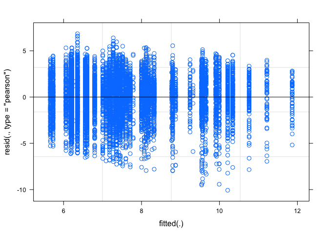

Conservation\_glm.R
================
Amy
Mon Nov 12 16:09:52 2018

``` r
library(ggplot2)
library(tidyr)
library(tidyverse)
```

    ## ── Attaching packages ───────────────────────────────────────────── tidyverse 1.2.1 ──

    ## ✔ tibble  1.4.2     ✔ dplyr   0.7.6
    ## ✔ readr   1.1.1     ✔ stringr 1.3.1
    ## ✔ purrr   0.2.5     ✔ forcats 0.3.0

    ## ── Conflicts ──────────────────────────────────────────────── tidyverse_conflicts() ──
    ## ✖ dplyr::filter() masks stats::filter()
    ## ✖ dplyr::lag()    masks stats::lag()

``` r
library(arm)
```

    ## Loading required package: MASS

    ## 
    ## Attaching package: 'MASS'

    ## The following object is masked from 'package:dplyr':
    ## 
    ##     select

    ## Loading required package: Matrix

    ## 
    ## Attaching package: 'Matrix'

    ## The following object is masked from 'package:tidyr':
    ## 
    ##     expand

    ## Loading required package: lme4

    ## 
    ## arm (Version 1.10-1, built: 2018-4-12)

    ## Working directory is /Users/Amy/Desktop/Data_science/git/Individual_project

``` r
library(gridExtra) #To allow arranging multiple plots
```

    ## 
    ## Attaching package: 'gridExtra'

    ## The following object is masked from 'package:dplyr':
    ## 
    ##     combine

``` r
library(dplyr)
library(rstan) #for extract function
```

    ## Loading required package: StanHeaders

    ## rstan (Version 2.17.3, GitRev: 2e1f913d3ca3)

    ## For execution on a local, multicore CPU with excess RAM we recommend calling
    ## options(mc.cores = parallel::detectCores()).
    ## To avoid recompilation of unchanged Stan programs, we recommend calling
    ## rstan_options(auto_write = TRUE)

    ## 
    ## Attaching package: 'rstan'

    ## The following object is masked from 'package:arm':
    ## 
    ##     traceplot

    ## The following object is masked from 'package:tidyr':
    ## 
    ##     extract

``` r
library(rstanarm)
```

    ## Loading required package: Rcpp

    ## rstanarm (Version 2.17.4, packaged: 2018-04-13 01:51:52 UTC)

    ## - Do not expect the default priors to remain the same in future rstanarm versions.

    ## Thus, R scripts should specify priors explicitly, even if they are just the defaults.

    ## - For execution on a local, multicore CPU with excess RAM we recommend calling

    ## options(mc.cores = parallel::detectCores())

    ## - Plotting theme set to bayesplot::theme_default().

``` r
options(mc.cores = parallel::detectCores())
theme_set(theme_grey()) #rstanarm overrides default ggplot theme: set it back


### Data Cleaning

Conservation_data<-read.csv("Conservation_data.csv",header=TRUE)
#names(Conservation_data)
dat<-Conservation_data[,c(1,2,3,5,6,11,13,15,17)]
head(dat)
```

    ##   County_ID_FIPS State_FIPS County_FIPS   County_Name    State_Name
    ## 1          25025         25          25       Suffolk Massachusetts
    ## 2           6075          6          75 San Francisco    California
    ## 3          35028         35          28    Los Alamos    New Mexico
    ## 4          51013         51          13     Arlington      Virginia
    ## 5          27123         27         123        Ramsey     Minnesota
    ## 6          22071         22          71       Orleans     Louisiana
    ##   Area_GapStatus1_PAs_ha Area_GapStatus2_PAs_ha Area_GapStatus3_PAs_ha
    ## 1                  0.000           6.207472e+04            16726.48159
    ## 2               6130.509           3.748194e+04            20888.93169
    ## 3               3950.024           4.856699e-01            15150.86564
    ## 4                  0.000           1.398152e+01               69.85727
    ## 5                  0.000           1.329744e+02             3811.05186
    ## 6              10156.619           2.569581e+02                0.00000
    ##   Area_GapStatus4_PAs_ha
    ## 1            1371.759112
    ## 2             612.651704
    ## 3           11241.495440
    ## 4             663.095872
    ## 5               1.731649
    ## 6             711.709482

``` r
#View(dat)
colnames(dat)[6:9]<-c("G1","G2","G3","G4") # To simplify and limit typing
head(dat)
```

    ##   County_ID_FIPS State_FIPS County_FIPS   County_Name    State_Name
    ## 1          25025         25          25       Suffolk Massachusetts
    ## 2           6075          6          75 San Francisco    California
    ## 3          35028         35          28    Los Alamos    New Mexico
    ## 4          51013         51          13     Arlington      Virginia
    ## 5          27123         27         123        Ramsey     Minnesota
    ## 6          22071         22          71       Orleans     Louisiana
    ##          G1           G2          G3           G4
    ## 1     0.000 6.207472e+04 16726.48159  1371.759112
    ## 2  6130.509 3.748194e+04 20888.93169   612.651704
    ## 3  3950.024 4.856699e-01 15150.86564 11241.495440
    ## 4     0.000 1.398152e+01    69.85727   663.095872
    ## 5     0.000 1.329744e+02  3811.05186     1.731649
    ## 6 10156.619 2.569581e+02     0.00000   711.709482

``` r
dat[,6:9]<-round(dat[,6:9],digits=3) # Any protected area with less than 0.001 hectares will become zero
dat[, 6:9][dat[, 6:9] == 0] <- NA # Zeros become NA to remove easily when stacked with melt
#head(dat)
```

Sanity check for when NA’s are removed. Calculating the NA’s for
Gap\_Status1:4 (columns 6:9)

``` r
n<-NULL
  for (i in 6:9) {
    n[i]<-length(dat[,i][!is.na(dat[,i])])
  }
  sum<-sum(n,na.rm=TRUE)
sum
```

    ## [1] 9327

Length should be:

``` r
Correct_length<-paste("Length Should Be:",sum)
Correct_length
```

    ## [1] "Length Should Be: 9327"

Stacking the data:

``` r
library(reshape2)
```

    ## 
    ## Attaching package: 'reshape2'

    ## The following object is masked from 'package:tidyr':
    ## 
    ##     smiths

``` r
dat1 <- melt(dat, id.vars=1:5, na.rm=TRUE, value.name="PA_ha")
head(dat1)
```

    ##    County_ID_FIPS State_FIPS County_FIPS   County_Name   State_Name
    ## 2            6075          6          75 San Francisco   California
    ## 3           35028         35          28    Los Alamos   New Mexico
    ## 6           22071         22          71       Orleans    Louisiana
    ## 7           34013         34          13         Essex   New Jersey
    ## 9           12103         12         103      Pinellas      Florida
    ## 10          42101         42         101  Philadelphia Pennsylvania
    ##    variable     PA_ha
    ## 2        G1  6130.509
    ## 3        G1  3950.024
    ## 6        G1 10156.619
    ## 7        G1   116.977
    ## 9        G1  7907.001
    ## 10       G1     9.856

``` r
#View(dat1)
names(dat1)
```

    ## [1] "County_ID_FIPS" "State_FIPS"     "County_FIPS"    "County_Name"   
    ## [5] "State_Name"     "variable"       "PA_ha"

``` r
colnames(dat1)[6]<-"Gap_Status"
head(dat1)
```

    ##    County_ID_FIPS State_FIPS County_FIPS   County_Name   State_Name
    ## 2            6075          6          75 San Francisco   California
    ## 3           35028         35          28    Los Alamos   New Mexico
    ## 6           22071         22          71       Orleans    Louisiana
    ## 7           34013         34          13         Essex   New Jersey
    ## 9           12103         12         103      Pinellas      Florida
    ## 10          42101         42         101  Philadelphia Pennsylvania
    ##    Gap_Status     PA_ha
    ## 2          G1  6130.509
    ## 3          G1  3950.024
    ## 6          G1 10156.619
    ## 7          G1   116.977
    ## 9          G1  7907.001
    ## 10         G1     9.856

``` r
length(dat1$Gap_Status)
```

    ## [1] 9327

``` r
Correct_length
```

    ## [1] "Length Should Be: 9327"

``` r
#View(dat1)
```

Truncating data at 1 hectare, because less than one is probably an error
or unimportant:

``` r
data<-filter(dat1, PA_ha>=1) # Sanity check
sc<-filter(dat1, PA_ha<1)
(length(data$PA_ha) + length(sc$PA_ha))==length(dat1$PA_ha)
```

    ## [1] TRUE

``` r
Correct_length2<-paste("Length Should Be:",length(data$PA_ha))
rm(data,sc) # Cleaning up
dat1<-filter(dat1, PA_ha>=1)
length(dat1$PA_ha)
```

    ## [1] 9165

``` r
Correct_length2
```

    ## [1] "Length Should Be: 9165"

``` r
rm(i,n,sum,Correct_length,Correct_length2,dat) # cleaning up
```

Plots all states with hectares of protected area by gap status

``` r
dat1 %>%
  mutate(yjit=jitter(0*PA_ha)) %>%
  ggplot() +
  geom_point(mapping = aes(x=PA_ha,col=Gap_Status,y=yjit),shape=1,alpha=0.5) +
  facet_wrap(facets = ~ State_Name) +
  scale_x_continuous(breaks=c(0,1000000,2000000),limits=c(0,3000000)) +
  theme(axis.text.y=element_blank(),axis.ticks.y=element_blank(),
        axis.title.y=element_blank(),panel.grid=element_blank())
```

    ## Warning: Removed 2 rows containing missing values (geom_point).

<!-- -->

How many samples per gap status?

``` r
n<-NULL
for (i in 1:4) {
  n[i]<-length(dat1$Gap_Status[dat1$Gap_Status==paste("G",i,sep="")])
}
names(n)<-c("G1","G2","G3","G4")
n
```

    ##   G1   G2   G3   G4 
    ## 1256 2793 2414 2702

``` r
head(dat1)
```

    ##   County_ID_FIPS State_FIPS County_FIPS   County_Name   State_Name
    ## 1           6075          6          75 San Francisco   California
    ## 2          35028         35          28    Los Alamos   New Mexico
    ## 3          22071         22          71       Orleans    Louisiana
    ## 4          34013         34          13         Essex   New Jersey
    ## 5          12103         12         103      Pinellas      Florida
    ## 6          42101         42         101  Philadelphia Pennsylvania
    ##   Gap_Status     PA_ha
    ## 1         G1  6130.509
    ## 2         G1  3950.024
    ## 3         G1 10156.619
    ## 4         G1   116.977
    ## 5         G1  7907.001
    ## 6         G1     9.856

``` r
dat1 %>%
  group_by(State_Name) %>%
  summarize(sample_size=n()) %>%
  arrange(-sample_size)
```

    ## # A tibble: 49 x 2
    ##    State_Name     sample_size
    ##    <fct>                <int>
    ##  1 Texas                  508
    ##  2 Georgia                445
    ##  3 Virginia               387
    ##  4 Illinois               345
    ##  5 Missouri               307
    ##  6 Kentucky               303
    ##  7 North Carolina         303
    ##  8 Ohio                   301
    ##  9 Indiana                291
    ## 10 Minnesota              291
    ## # ... with 39 more rows

``` r
rm(i,n) #cleaning up
```

We see 8 State with more than 300 protected areas sampled. Let’s extract
these (using `filter()`) to get a better sense of how area of PA
distributions within State might vary between State. We’ll also restrict
to data from the largest gap status = G2 names(dat1) lrgst8State\_G2 \<-
dat1 %\>% group\_by(State\_Name) %\>% filter(n() \>
300,Gap\_Status==“G2”) \#’ Histograms for the eight states.
ggplot(data=lrgst8State\_G2) + geom\_histogram(mapping =
aes(x=PA\_ha,y=stat(density)),bins=36) + facet\_wrap(facets = ~
State\_Name)

# All Gap statuses

names(dat1) lrgst8State\_all \<- dat1 %\>% group\_by(State\_Name) %\>%
filter(n() \> 300) \#’ Histograms for the eight states.
ggplot(data=lrgst8State\_all) + geom\_histogram(mapping =
aes(x=PA\_ha,y=stat(density)),bins=36) + facet\_wrap(facets = ~
State\_Name) \# pretty concentrated around small protected areas

# Overlapping histograms:

ggplot(data=lrgst8State\_all) + geom\_histogram(mapping =
aes(x=PA\_ha,y=stat(density),fill=State\_Name),
position=“identity”,bins=36,alpha=0.6) \#Density plot:
ggplot(data=lrgst8State\_all) + geom\_density(mapping =
aes(x=PA\_ha,col=State\_Name))

# All those plots with log transformation:

\#’ Histograms for the eight states. ggplot(data=lrgst8State\_all) +
geom\_histogram(mapping = aes(x=log(PA\_ha),y=stat(density)),bins=36) +
facet\_wrap(facets = ~ State\_Name) \# Overlapping histograms:
ggplot(data=lrgst8State\_all) + geom\_histogram(mapping =
aes(x=log(PA\_ha),y=stat(density),fill=State\_Name),
position=“identity”,bins=36,alpha=0.6) \#Density plot:
ggplot(data=lrgst8State\_all) + geom\_density(mapping =
aes(x=log(PA\_ha),col=State\_Name))

``` r
# So, definitely want to log transform:
dat1<-mutate(dat1,log_PA_ha=log(PA_ha))
head(dat1)
```

    ##   County_ID_FIPS State_FIPS County_FIPS   County_Name   State_Name
    ## 1           6075          6          75 San Francisco   California
    ## 2          35028         35          28    Los Alamos   New Mexico
    ## 3          22071         22          71       Orleans    Louisiana
    ## 4          34013         34          13         Essex   New Jersey
    ## 5          12103         12         103      Pinellas      Florida
    ## 6          42101         42         101  Philadelphia Pennsylvania
    ##   Gap_Status     PA_ha log_PA_ha
    ## 1         G1  6130.509  8.721033
    ## 2         G1  3950.024  8.281477
    ## 3         G1 10156.619  9.225881
    ## 4         G1   116.977  4.761977
    ## 5         G1  7907.001  8.975504
    ## 6         G1     9.856  2.288080

Take a look at the transformed data in those 8 states First make a data
frame with the estimated normal distribution for the 8 states Summary
statistics for 8 states summ8State \<- dat1 %\>% group\_by(State\_Name)
%\>% filter(n() \> 300,Gap\_Status==“G2”) %\>%
summarize(mean=mean(log\_PA\_ha),sd=sd(log\_PA\_ha),min=min(log\_PA\_ha),max=max(log\_PA\_ha))

\#’ Normal fitted for 5 counties and collected into a dataframe.
norm\_df \<- NULL for ( i in 1:8 ) { x \<-
seq(summ8State\(min[i],summ8State\)max\[i\],length.out = 100) y \<-
dnorm(x, summ8State\(mean[i], summ8State\)sd\[i\]) norm\_df \<-
rbind(norm\_df,data.frame(x,y,State\_Name=summ8State$State\_Name\[i\]))
} rm(x,y) \#clean up

\#’ Now plot the transformed data with density smoother (blue) and
fitted normal \#’ (red). The log transformation seems very good: dat1
%\>% group\_by(State\_Name) %\>% filter(n() \> 300,Gap\_Status==“G2”)
%\>% ggplot() + geom\_histogram(mapping =
aes(x=log\_PA\_ha,y=stat(density)),bins=25) + geom\_density(mapping =
aes(x=log\_PA\_ha),col=“blue”) + geom\_line(data=norm\_df, mapping =
aes(x=x,y=y),col=“red”) + facet\_wrap(facets = ~ State\_Name) And now
for the whole dataset split by gap status It is simple to modify the
above code to group by gap status instead.

``` r
summ_byGap_Status <-
  dat1 %>%
  group_by(Gap_Status) %>%
  summarize(mean=mean(log_PA_ha),sd=sd(log_PA_ha),min=min(log_PA_ha),max=max(log_PA_ha))
```

Normal fitted for 4 Gap Statuses

``` r
norm_df <- NULL
for ( i in 1:4 ) {
  x <- seq(summ_byGap_Status$min[i],summ_byGap_Status$max[i],length.out = 100)
  y <- dnorm(x, summ_byGap_Status$mean[i], summ_byGap_Status$sd[i])
  norm_df <- rbind(norm_df,data.frame(x,y,Gap_Status=summ_byGap_Status$Gap_Status[i]))
}
rm(x,y)
```

Now plot the transformed data with density smoother (blue) and fitted
normal (red).

``` r
dat1 %>%
  group_by(Gap_Status) %>%
  ggplot() +
  geom_histogram(mapping = aes(x=log_PA_ha,y=stat(density)),bins=25) +
  geom_density(mapping = aes(x=log_PA_ha),col="blue") +
  geom_line(data=norm_df, mapping = aes(x=x,y=y),col="red") +
  facet_wrap(facets = ~ Gap_Status)
```

<!-- -->

``` r
# Log Transformation works well
```

Start by converting State\_Name to a factor

``` r
dat1 <- mutate(dat1,State_Name=factor(State_Name))
```

#### Complete pooling

In this case, complete pooling is just the overall mean. That is, we
omit any data structure or grouping variables.

``` r
poolmean <- mean(dat1$log_PA_ha)
poolmean
```

    ## [1] 7.584689

``` r
cp_pred_df <- data.frame(poolmean) #df for use with ggplot
```

#### No pooling

You can think of **no pooling** as separately calculating an estimate of
the mean for each State\_Name. For example, tabulate the means for each
State\_Name (and sd and se):

``` r
lnPA_mean_var <- 
  dat1 %>%
  group_by(State_Name) %>%
  summarize(sample_size=n(),ST_mn=mean(log_PA_ha),ST_sd=sd(log_PA_ha)) %>%
  mutate(ST_se=ST_sd/sqrt(sample_size)) %>%
  mutate(sample_size_jit=jitter(sample_size)) #jitter added for plotting
```

Looking at the whole result to check that everything makes sense and
scan for problems.

``` r
print(lnPA_mean_var,n=Inf) #n=Inf to print all rows
```

    ## # A tibble: 49 x 6
    ##    State_Name           sample_size ST_mn ST_sd ST_se sample_size_jit
    ##    <fct>                      <int> <dbl> <dbl> <dbl>           <dbl>
    ##  1 Alabama                      201  7.08  1.92 0.135          201.  
    ##  2 Arizona                       60 12.0   1.88 0.242           60.0 
    ##  3 Arkansas                     202  7.45  2.54 0.179          202.  
    ##  4 California                   220 10.4   2.05 0.138          220.  
    ##  5 Colorado                     226  9.56  2.42 0.161          226.  
    ##  6 Connecticut                   29  8.28  2.00 0.371           29.0 
    ##  7 Delaware                      10  9.59  2.44 0.771           10.0 
    ##  8 District of Columbia           4  5.28  2.90 1.45             3.87
    ##  9 Florida                      245  8.81  2.25 0.144          245.  
    ## 10 Georgia                      445  6.59  2.25 0.106          445.  
    ## 11 Idaho                        150  9.59  2.93 0.239          150.  
    ## 12 Illinois                     345  6.17  2.13 0.115          345.  
    ## 13 Indiana                      291  5.71  2.02 0.118          291.  
    ## 14 Iowa                         263  5.64  2.13 0.132          263.  
    ## 15 Kansas                       178  6.04  2.14 0.161          178.  
    ## 16 Kentucky                     303  6.20  2.07 0.119          303.  
    ## 17 Louisiana                    202  7.41  2.22 0.156          202.  
    ## 18 Maine                         56  9.72  2.47 0.330           56.0 
    ## 19 Maryland                      75  8.90  1.82 0.210           74.9 
    ## 20 Massachusetts                 55  9.29  1.85 0.249           55.1 
    ## 21 Michigan                     276  7.51  2.36 0.142          276.  
    ## 22 Minnesota                    291  7.27  2.76 0.162          291.  
    ## 23 Mississippi                  225  7.71  2.00 0.133          225.  
    ## 24 Missouri                     307  6.54  2.57 0.147          307.  
    ## 25 Montana                      188 10.2   2.35 0.171          188.  
    ## 26 Nebraska                     217  6.19  2.06 0.140          217.  
    ## 27 Nevada                        60 11.3   2.64 0.340           60.0 
    ## 28 New Hampshire                 40  8.81  1.99 0.314           40.2 
    ## 29 New Jersey                    81  8.23  1.96 0.218           80.8 
    ## 30 New Mexico                   117 10.8   2.14 0.198          117.  
    ## 31 New York                     205  8.07  2.08 0.145          205.  
    ## 32 North Carolina               303  7.36  2.35 0.135          303.  
    ## 33 North Dakota                 157  8.33  1.89 0.151          157.  
    ## 34 Ohio                         301  6.18  1.96 0.113          301.  
    ## 35 Oklahoma                     205  8.17  2.03 0.142          205.  
    ## 36 Oregon                       135  9.96  2.32 0.200          135.  
    ## 37 Pennsylvania                 257  7.59  2.09 0.130          257.  
    ## 38 Rhode Island                  20  7.75  2.56 0.572           20.0 
    ## 39 South Carolina               141  7.34  2.21 0.186          141.  
    ## 40 South Dakota                 189  8.12  2.32 0.169          189.  
    ## 41 Tennessee                    241  6.79  2.19 0.141          241.  
    ## 42 Texas                        508  6.35  2.58 0.115          508.  
    ## 43 Utah                         111 10.0   2.93 0.278          111.  
    ## 44 Vermont                       54  8.32  1.86 0.253           54.0 
    ## 45 Virginia                     387  7.18  2.35 0.120          387.  
    ## 46 Washington                   150  9.66  2.46 0.201          150.  
    ## 47 West Virginia                136  6.99  2.39 0.205          136.  
    ## 48 Wisconsin                    222  8.00  2.01 0.135          222.  
    ## 49 Wyoming                       81  9.95  2.87 0.319           80.9

``` r
#View(lnPA_mean_var)
ggplot(data=lnPA_mean_var) +
  geom_hline(mapping=aes(yintercept=poolmean),data=cp_pred_df,col="blue") +
  geom_point(mapping=aes(x=sample_size_jit,y=ST_mn)) +
  geom_linerange(mapping=aes(x=sample_size_jit,ymin=ST_mn-ST_se,ymax=ST_mn+ST_se)) +
  scale_x_continuous(trans="log",breaks=c(7,20,55,148,400)) +
  labs(x="Sample size in State j",y="mean ln(PA hectares) in State j",
       title="No pooling: separate analyses by State")
```

<!-- -->

``` r
#The blue line is the completely pooled estimate (the overall mean). Some of the standard
```

errors are large, because we have calculated them independently for each
state. The **no pooling** analysis for the state means. This analysis
does not pool information about the **means** but it does pool
information about the uncertainty (the error of each observation
contributes to an estimate of the mean residual error). This is
sometimes called the **fixed effects model**, where here `state` is the
fixed effect. To fit this model in a frequentist paradigm we can use
`lm()`, which is implicitly a GLM with Normal distribution and identity
link. We fit `state` as a categorical variable, which gives us estimated
means for each state where the maximum likelihood estimate is just the
mean of the within-state samples. We use the means parameterization (i.e
without the intercept, thus “-1”):

``` r
npfit <- lm( log_PA_ha ~ -1 + State_Name, data=dat1 )
```

Check the fitted model (diagnostic
plots)

``` r
plot(npfit,1:5,ask=FALSE)
```

<!-- --><!-- --><!-- --><!-- --><!-- -->

The extended left tail, including the 0 + 0.1 hack, is evident in the QQ
plot but otherwise the diagnostics look good. Let’s also look at a
residuals histogram compared to the Normal distribution:

``` r
r <- residuals(npfit)
x <- seq(min(r),max(r),length.out=100)
y <- dnorm(x,mean(r),sd(r))
res_df <- data.frame(residuals=r)
norm_df <- data.frame(x=x,y=y)
rm(r,x,y)
ggplot() +
  geom_histogram(mapping=aes(x=residuals,y=stat(density)),data=res_df,bins=60) +
  geom_line(mapping=aes(x=x,y=y),col="red",data=norm_df)
```

<!-- -->

So, Normal looks like a good approximation for the errors. Plot the
fitted
model.

``` r
np_pred_df <- data.frame(coef(summary(npfit))[,1:2],lnPA_mean_var$sample_size_jit)
names(np_pred_df) <- c("ST_mn","ST_se","sample_size_jit")
plotONE <- 
  ggplot(data=np_pred_df) +
  geom_hline(mapping=aes(yintercept=poolmean),data=cp_pred_df,col="blue") +
  geom_point(mapping=aes(x=sample_size_jit,y=ST_mn)) +
  geom_linerange(mapping=aes(x=sample_size_jit,ymin=ST_mn-ST_se,ymax=ST_mn+ST_se)) +
  scale_x_continuous(trans="log",breaks=c(7,20,55,148,400)) +
  ylim(4,14) +
  labs(x="Sample size in State_Name j",y="mean ln(PA_ha) in State_Name j",
       title="No pooling: estimates from linear model fit")
plotONE
```

<!-- -->

``` r
#The blue line is the complete pooling model (i.e. the overall mean).
```

#### Partial pooling & shrinkage in multilevel model

In the **complete pooling** model (i.e. the overall mean) we did not
include variation among states, while in the **no pooling** model, we
estimated the state means separately, whether literally by separate
analyses or in the fixed effects model. In the **partial pooling** model
the estimates for the mean in each state are a balance between the
information in a state sample and information from other states. To
achieve this, we formulate a **multilevel model**. In the multilevel
model we consider two levels for means: an overall mean and means for
states. Each of the two levels of these means has an associated
stochastic process so that there are two variance components, a
between-state variance associated with the overall mean and a
within-state variance associated with the state means. To fit this model
in a frequentist paradigm we can use `lmer()` from the package `lme4`.
This model is implicitly a generalized linear mixed model (GLMM) with
Normal distribution, identity link, and two levels of stochasticity:

``` r
ppfit <- lmer( log_PA_ha ~ 1 + (1|State_Name), REML=FALSE, data=dat1 )
```

The `1` part of the above model specifies the overall mean (the
intercept term) while the `+ (1|state)` part specifies that the
intercepts for each state should be random variables (more specifically
the deviations, or “random effects”, of state means from the overall
mean will be modeled as a Normally distributed random variable).
`REML=FALSE` says to fit by ordinary maximum likelihood rather than the
default residual maximum likelihood.

By default, we get limited diagnostics for `lmer()`. Just residuals vs
fitted. The residual plot looks good though. We will later explore some
other diagnostic options.

``` r
plot(ppfit)
```

<!-- -->

In the summary we now see estimates for two levels (or strata) of
variance, state (among states) and residual (among counties within
states):

``` r
summary(ppfit)
```

    ## Linear mixed model fit by maximum likelihood  ['lmerMod']
    ## Formula: log_PA_ha ~ 1 + (1 | State_Name)
    ##    Data: dat1
    ## 
    ##      AIC      BIC   logLik deviance df.resid 
    ##  41255.1  41276.5 -20624.6  41249.1     9162 
    ## 
    ## Scaled residuals: 
    ##     Min      1Q  Median      3Q     Max 
    ## -4.4342 -0.6280  0.1072  0.6952  3.0138 
    ## 
    ## Random effects:
    ##  Groups     Name        Variance Std.Dev.
    ##  State_Name (Intercept) 2.385    1.544   
    ##  Residual               5.157    2.271   
    ## Number of obs: 9165, groups:  State_Name, 49
    ## 
    ## Fixed effects:
    ##             Estimate Std. Error t value
    ## (Intercept)   8.0962     0.2238   36.18

Plot the fitted
model

``` r
pp_pred_df <- data.frame(coef(ppfit)$State_Name,se.ranef(ppfit)$State_Name[,1],lnPA_mean_var$sample_size_jit)
names(pp_pred_df) <- c("ST_mn","ST_se","sample_size_jit")
pp_mean_df <- data.frame(ovrl_mn=summary(ppfit)$coefficients[1],ovrl_se=summary(ppfit)$coefficients[2])
plotTWO <- 
  ggplot(data=pp_pred_df) +
  geom_hline(mapping=aes(yintercept=poolmean),data=cp_pred_df,col="blue") +
  geom_hline(mapping=aes(yintercept=ovrl_mn),data=pp_mean_df,col="blue",lty=2) +
  geom_point(mapping=aes(x=sample_size_jit,y=ST_mn)) +
  geom_linerange(mapping=aes(x=sample_size_jit,ymin=ST_mn-ST_se,ymax=ST_mn+ST_se)) +
  scale_x_continuous(trans="log",breaks=c(7,20,55,148,400)) +
  ylim(4,14) +
  labs(x="Sample size in State_Name j",y="mean ln(PA_ha) in State_Name j",
       title="Partial pooling: multilevel model, max likelihood")
plotTWO
```

<!-- -->

Add a reference point to no pooling and partial pooling plots

``` r
plotONE_ref <- plotONE + 
  geom_point(mapping=aes(x=sample_size_jit,y=ST_mn),data=np_pred_df[8,],pch=1,cex=10,col="red")


plotTWO_ref <- plotTWO + 
  geom_point(mapping=aes(x=sample_size_jit,y=ST_mn),data=pp_pred_df[8,],pch=1,cex=10,col="red")
```

Plot side by side

``` r
grid.arrange(plotONE_ref, plotTWO_ref, nrow = 1) 
```

<!-- -->

The right panel is the fitted multilevel model compared to our previous
fit of the no pooling model in the left panel. In the multilevel model
the estimates for the mean in each state are a balance between the
sample mean and the overall mean, depending on the within-state sample
size. That is, the information in a particular state is pooled with the
information from other states. You can see how this works by comparing
the multilevel (partial pooling) model in the right panel to the no
pooling model in the left panel. If there are more observations for a
given state, there is more information at the state level, so the
estimate of the state mean in the multilevel model remains close to the
sample mean. If there are fewer observations, information from the other
states will pull an estimate for a particular state toward the overall
mean, like state 8 (DC), which is circled in red. This is called
**shrinkage**. In this case, it moves upward when shrinking, because it
is lower than the overall mean. The other thing to note is the dashed
blue line. This is the estimated overall mean from the multilevel model,
which is also a balance of the information at different levels. You can
see that it is higher than simply the overall mean of the data (solid
blue line). \#\#\#\# Partial pooling, Bayesian fit of multilevel model
Compared to the maximum likelihood model we just fitted, this model had
flat priors for the three model parameters (overall mean and the two
variances). The Bayesian version of this model is accomplished easily
with ’ the `stan_glm()` function of `rstanarm`.

``` r
ppfit_bayes <- stan_lmer( log_PA_ha ~ 1 + (1|State_Name), data=dat1 )
print(summary(ppfit_bayes)[,c(1,3,9,10)],digits=3)
```

    ##                                                     mean     sd n_eff Rhat
    ## (Intercept)                                     8.10e+00 0.2400   142 1.01
    ## b[(Intercept) State_Name:Alabama]              -1.01e+00 0.2870   195 1.01
    ## b[(Intercept) State_Name:Arizona]               3.77e+00 0.3742   325 1.00
    ## b[(Intercept) State_Name:Arkansas]             -6.46e-01 0.2853   197 1.01
    ## b[(Intercept) State_Name:California]            2.24e+00 0.2840   199 1.01
    ## b[(Intercept) State_Name:Colorado]              1.44e+00 0.2807   190 1.01
    ## b[(Intercept) State_Name:Connecticut]           1.65e-01 0.4666   506 1.00
    ## b[(Intercept) State_Name:Delaware]              1.20e+00 0.6943   977 1.00
    ## b[(Intercept) State_Name:District_of_Columbia] -1.87e+00 0.9572  1337 1.00
    ## b[(Intercept) State_Name:Florida]               6.96e-01 0.2821   188 1.01
    ## b[(Intercept) State_Name:Georgia]              -1.50e+00 0.2626   167 1.01
    ## b[(Intercept) State_Name:Idaho]                 1.47e+00 0.2971   226 1.01
    ## b[(Intercept) State_Name:Illinois]             -1.92e+00 0.2660   172 1.01
    ## b[(Intercept) State_Name:Indiana]              -2.37e+00 0.2711   186 1.01
    ## b[(Intercept) State_Name:Iowa]                 -2.44e+00 0.2748   193 1.01
    ## b[(Intercept) State_Name:Kansas]               -2.04e+00 0.2891   212 1.01
    ## b[(Intercept) State_Name:Kentucky]             -1.89e+00 0.2732   178 1.01
    ## b[(Intercept) State_Name:Louisiana]            -6.87e-01 0.2839   203 1.01
    ## b[(Intercept) State_Name:Maine]                 1.57e+00 0.3808   340 1.00
    ## b[(Intercept) State_Name:Maryland]              7.67e-01 0.3532   306 1.00
    ## b[(Intercept) State_Name:Massachusetts]         1.15e+00 0.3854   345 1.00
    ## b[(Intercept) State_Name:Michigan]             -5.85e-01 0.2755   185 1.01
    ## b[(Intercept) State_Name:Minnesota]            -8.22e-01 0.2715   183 1.01
    ## b[(Intercept) State_Name:Mississippi]          -3.88e-01 0.2819   194 1.01
    ## b[(Intercept) State_Name:Missouri]             -1.55e+00 0.2721   181 1.01
    ## b[(Intercept) State_Name:Montana]               2.11e+00 0.2893   199 1.01
    ## b[(Intercept) State_Name:Nebraska]             -1.89e+00 0.2833   192 1.01
    ## b[(Intercept) State_Name:Nevada]                3.12e+00 0.3689   332 1.00
    ## b[(Intercept) State_Name:New_Hampshire]         6.68e-01 0.4173   438 1.00
    ## b[(Intercept) State_Name:New_Jersey]            1.29e-01 0.3392   295 1.01
    ## b[(Intercept) State_Name:New_Mexico]            2.66e+00 0.3147   237 1.01
    ## b[(Intercept) State_Name:New_York]             -3.23e-02 0.2824   195 1.01
    ## b[(Intercept) State_Name:North_Carolina]       -7.41e-01 0.2721   177 1.01
    ## b[(Intercept) State_Name:North_Dakota]          2.23e-01 0.2955   213 1.01
    ## b[(Intercept) State_Name:Ohio]                 -1.91e+00 0.2705   185 1.01
    ## b[(Intercept) State_Name:Oklahoma]              7.14e-02 0.2832   197 1.01
    ## b[(Intercept) State_Name:Oregon]                1.82e+00 0.3062   233 1.01
    ## b[(Intercept) State_Name:Pennsylvania]         -5.03e-01 0.2798   193 1.01
    ## b[(Intercept) State_Name:Rhode_Island]         -3.07e-01 0.5328   729 1.00
    ## b[(Intercept) State_Name:South_Carolina]       -7.51e-01 0.3028   213 1.01
    ## b[(Intercept) State_Name:South_Dakota]          1.68e-02 0.2880   201 1.00
    ## b[(Intercept) State_Name:Tennessee]            -1.31e+00 0.2813   187 1.01
    ## b[(Intercept) State_Name:Texas]                -1.75e+00 0.2596   171 1.01
    ## b[(Intercept) State_Name:Utah]                  1.89e+00 0.3167   240 1.01
    ## b[(Intercept) State_Name:Vermont]               2.13e-01 0.3854   378 1.00
    ## b[(Intercept) State_Name:Virginia]             -9.20e-01 0.2634   170 1.01
    ## b[(Intercept) State_Name:Washington]            1.54e+00 0.2998   216 1.00
    ## b[(Intercept) State_Name:West_Virginia]        -1.10e+00 0.3048   222 1.01
    ## b[(Intercept) State_Name:Wisconsin]            -9.93e-02 0.2824   200 1.01
    ## b[(Intercept) State_Name:Wyoming]               1.80e+00 0.3472   272 1.01
    ## sigma                                           2.27e+00 0.0172  2488 1.00
    ## Sigma[State_Name:(Intercept),(Intercept)]       2.62e+00 0.6067   245 1.02
    ## mean_PPD                                        7.59e+00 0.0337  3738 1.00
    ## log-posterior                                  -2.06e+04 7.1355   360 1.01

Diagnostics

``` r
#launch_shinystan(ppfit_bayes)

########################## Here
```

Extract posterior samples

``` r
detach("package:tidyverse", unload=TRUE) # extract name conflict
samples <- extract(ppfit_bayes$stanfit)
names(samples)
```

    ## [1] "alpha"    "b"        "aux"      "theta_L"  "mean_PPD" "lp__"

``` r
str(samples$alpha) #Samples of overall mean. Matrix: samples by row,  1 col, 4000 rows
```

    ##  num [1:4000, 1] 8.28 8.23 7.98 8.31 7.88 ...
    ##  - attr(*, "dimnames")=List of 2
    ##   ..$ iterations: NULL
    ##   ..$           : NULL

``` r
str(samples$b) #Samples of state deviations. Matrix: samples by row, 50 cols, 4000 rows
```

    ##  num [1:4000, 1:50] -0.903 -1.017 -0.836 -1.329 -0.664 ...
    ##  - attr(*, "dimnames")=List of 2
    ##   ..$ iterations: NULL
    ##   ..$           : NULL

``` r
#Reload:
library(tidyr)
library(tidyverse)
```

Algorithm for posterior samples of the state means. We merely need to
add the samples for the overall mean (`alpha`) to the samples for the
state deviations (`b`).

``` r
State_samples <- samples$b[,1:49] * NA
for ( i in 1:49 ) {
  State_samples[,i] <- samples$b[,i] + samples$alpha
}

# Now calculate mean and standard deviation of the posterior distributions for
# the state means.
statepostmns <- rep(NA,49)
statepostses <- rep(NA,49)
for ( i in 1:49 ) {
  statepostmns[i] <- mean(State_samples[,i])
  statepostses[i] <- sd(State_samples[,i])
}
```

Plot of posterior means and standard
deviations

``` r
ppbayes_pred_df <- data.frame(statepostmns,statepostses,lnPA_mean_var$sample_size_jit)
names(ppbayes_pred_df) <- c("ST_mn","ST_se","sample_size_jit")
ppbayes_mean_df <- data.frame(ovrl_mn=mean(samples$alpha),ovrl_se=sd(samples$alpha))
plot_bayes <-
  ggplot(data=ppbayes_pred_df) +
  geom_hline(mapping=aes(yintercept=ovrl_mn),data=ppbayes_mean_df,col="blue",lty=2) +
  geom_point(mapping=aes(x=sample_size_jit,y=ST_mn)) +
  geom_linerange(mapping=aes(x=sample_size_jit,ymin=ST_mn-ST_se,ymax=ST_mn+ST_se)) +
  scale_x_continuous(trans="log",breaks=c(7,20,55,148,400)) +
  ylim(4,14) +
  annotate("text", label = paste(round(ppbayes_mean_df$ovrl_mn,digits=2), "ln(ha)"),x = 6.5, y = ppbayes_mean_df$ovrl_mn+0.3, size = 3.5, colour= "red")+
  annotate("text", label = paste("e^8.11=",round(exp(ppbayes_mean_df$ovrl_mn),digits=2),"ha"),x = 7, y = ppbayes_mean_df$ovrl_mn-0.3, size = 3.5, colour= "darkgreen")+
  labs(x="Sample size in state j",y="mean ln(PA hectares) in state j",
       title="Partial pooling: multilevel model, Bayesian")
grid.arrange(plotONE, plot_bayes, nrow = 1)
```

<!-- -->

``` r
#7.8
plot_bayes
```

<!-- -->

# 

# Part II: County Level Predictor

# 

\#’ This is part II. In part I, we did EDA and considered a variance
components \#’ model for counties within states, introducing the concept
of partial pooling \#’ and shrinkage (G\&H 12.2). Here, we will consider
a county-level (G\&H 12.3-4) \#’ predictor of hectares of protected
area. In part III, we will consider a State-level predictor. \#’ \#’ The
following data cleaning and manipulation is **Uneccessary** unless
starting from here. In that case: \#’ rm(list=ls()) library(lme4) \#max
lik multilevel: lmer(), glmer() etc library(arm) \#for se.ranef()
library(ggplot2) library(gridExtra) \#arranging multiple plots
library(dplyr)

\#’ Read in data and manipulate as required for analysis
Conservation\_data\<-read.csv(“Conservation\_data.csv”,header=TRUE)
dat\<-Conservation\_data\[,c(1,2,3,5,6,11,13,15,17)\]
\#colnames(dat)\[6:9\]\<-c(“G1”,“G2”,“G3”,“G4”) \# To simplify and limit
typing colnames(dat)\[6:9\]\<-c(1,2,3,4) \# To simplify and limit typing
dat\[,6:9\]\<-round(dat\[,6:9\],digits=3) \# Any protected area with
less than 0.001 hectares will become zero dat\[, 6:9\]\[dat\[, 6:9\] ==
0\] \<- NA \# Zeros become NA to remove easily when stacked with melt
\#’ Stacking the data: library(reshape2) dat1 \<- melt(dat,
id.vars=1:5, na.rm=TRUE, value.name=“PA\_ha”)
colnames(dat1)\[6\]\<-“Gap\_Status” \#’ Truncating data at 1 hectare,
because less than one is probably an error or unimportant:
dat1\<-filter(dat1, PA\_ha\>=1) \# Log Transform PA\_ha:
dat1\<-mutate(dat1,log\_PA\_ha=log(PA\_ha)) head(dat1)

\#’ \#\#\# G\&H 12.3. Analysis with predictor (Gap\_Status) at the
county level \#’ \#’ “county level” means county **scale**. This is the
spatial scale at which the \#’ predictor applies. The predictor at the
county level is *Gap\_Status* (G1:G4). There is no “county” identifier
in the dataset, so we are assuming \#’ that a county was either measured
in the basement *or* on the first Gap\_Status but \#’ never both. Thus,
there were no within-county measurements and the Gap\_Status is an \#’
attribute of the county that was measured (akin to county color, or
county \#’ size). If multiple measurements had been made within a
county, we would need \#’ to include another grouping variable,
*county*, in the model. \#’ \#’ G\&H p255 include *Gap\_Status* as a
continuous variable. It makes no difference \#’ whether it is continuous
or a factor for this particular model, it is just a \#’ different
parameterization. We will follow their analysis. \#’ \#’ Create the
continuous variable - call it \`Gap\_Status\_x\`\` to be consistent with
\#’ p255. \#dat1\(Gap_Status_x <- ifelse(dat1\)Gap\_Status==“G2”,0,1) \#
Is G2 = 0, Is not = 1

\#’ \#\#\#\# Complete pooling \#’ \#’ Complete pooling is the overall
regression mean. Again, we omit any \#’ data structure or grouping
variables. poolfit \<- lm(log\_PA\_ha ~ Gap\_Status, data=dat1)

\#’ Check the fitted model (diagnostic plots) \#+ warning=FALSE
plot(poolfit,1:5,ask=FALSE) plot(poolfit) \#’ No problems here that we
haven’t already discovered. summary(poolfit) \#’ Since “GS1” is coded as
0, the `(Intercept)` is the estimated mean hectares of protected area of
Gap Status 1. Since “Gap Status 2” is 1, the slope `Gap_Status_2` (or
\(\beta_1\)) \#’ here is estimating how hectares of protected area in
the second Gap\_Status differs from the first GS We \#’ see that the
second Gap\_Status \#’ \#’ on average has log PA\_ha 0.8 **higher** than
the \#’ first Gap Status. \#’ \#’ Save \(\beta\)s in dataframe for use
with ggplot: cp\_pred\_df \<-
data.frame(ovrl\_b0=coef(poolfit)\[1\],ovrl\_b1=coef(poolfit)\[2\])

\#’ \#\#\#\# No pooling \#’ \#’ In the no pooling analysis we will first
investigate a model that allows the \#’ mean hectares of protected area
to vary among states but assumes that the relationship between \#’
basement and first Gap\_Status stays the same among states. This model
is the \#’ **fixed effects** model, similar to the previous analysis we
did without the \#’ *Gap\_Status* predictor but now we include
`Gap_Status_x`. We use the means \#’ parameterization (i.e. -1 to remove
the overall intercept, which by default \#’ would otherwise arbitrarily
be hectares of protected area in the basement of the first State\_Name,
\#’ sorted alphabetically). npfit \<- lm( log\_PA\_ha ~ -1 + Gap\_Status
+ State\_Name, data=dat1 )

plot(npfit,1:5,ask=FALSE) \#’ Nothing terribly concerning in the
diagnostics. If we were going to use this \#’ model in a critical
application we ought to investigate the high leverage \#’ points but for
now we’ll note the warnings and wait to see if the problem \#’ persists
as we close in on a good model.

summary(npfit) \#’ As in the complete pooling model, the slope
(`Gap_Status_x`, or \(\beta_1\)) is \#’ negative, indicating lower
hectares of protected area on the first Gap\_Status. The estimate is
similar \#’ to, but a little different from, the complete pooling model.
The difference \#’ is because we’ve included another variable
(*State\_Name*) in the model, so the \#’ new estimate is after adjusting
for hectares of protected area levels among states. The `State_Name` \#’
estimates are the mean hectares of protected area level in the basement
for each State\_Name. In this \#’ parameterization, the `State_Name`
estimates are the y-intercept for each State\_Name. \#’ The *p*-values
are meaningless because they are testing a hypothesis we have \#’ no
interest in (i.e. log(PA\_ha) = 0, or PA\_ha = 1, in State\_Name
basements). \#’

\#’ Plot the fitted model (G\&H Fig. 12.2) for 8 selected states
np\_pred\_df \<- data.frame(coef(summary(npfit))\[-1,1:2\],
rep(coef(npfit)\[1\],85), unique(dat1$State\_Name)) names(np\_pred\_df)
\<- c(“st\_b0”,“st\_b0\_se”,“b1”,“State\_Name”) display8 \<- c(“LAC QUI
PARLE”,“AITKIN”,“KOOCHICHING”,“DOUGLAS”,“CLAY”,“STEARNS”, “RAMSEY”,“ST
LOUIS”) dat1 %\>% filter(State\_Name %in% display8) %\>% ggplot() +
geom\_abline(mapping=aes(slope=b1,intercept=st\_b0),
data=filter(np\_pred\_df,State\_Name %in% display8), col=“blue”) +
geom\_point(mapping=aes(x=jitter(Gap\_Status,0.2),y=log\_PA\_ha)) +
scale\_x\_continuous(breaks=c(0,1)) + facet\_wrap(facets = ~
State\_Name,ncol=4) + labs(x=“Gap\_Status”, y=“ln(PA\_ha)”, title=“No
pooling: estimates from linear model fit”) \#’ The features to notice
here are that the slope (measuring the difference in \#’ hectares of
protected area between Gap\_Statuss) is the same across states but the
estimated intercept \#’ differs. \#’

\#’ Plot the estimated intercepts (G\&H Fig. 12.3a)  
\#’ We will save this plot to compare to the partial pooling model. We
first need \#’ a jittered sample-size variable for plotting.
sample\_size\_df \<- dat1 %\>% group\_by(State\_Name) %\>%
summarize(sample\_size=n()) %\>%
mutate(sample\_size\_jit=jitter(sample\_size)) \#jitter added for
plotting np\_pred\_df \<- cbind(np\_pred\_df,sample\_size\_df\[,-1\])

gh12.3a \<- ggplot(data=np\_pred\_df) +
geom\_hline(mapping=aes(yintercept=ovrl\_b0),data=cp\_pred\_df,col=“blue”)
+ geom\_point(mapping=aes(x=sample\_size\_jit,y=st\_b0)) +
geom\_linerange(mapping=aes(x=sample\_size\_jit,ymin=st\_b0-st\_b0\_se,ymax=st\_b0+st\_b0\_se))
+ scale\_x\_continuous(trans=“log”,breaks=c(1,3,10,30,100)) +
ylim(-0.1,3.5) + labs(x=“Sample size in State\_Name j”,y=“Estimated
intercept in State\_Name j”, title=“No pooling: estimates from linear
model fit”) gh12.3a

\#’ \#\#\#\# Partial pooling: multilevel model \#’ \#’ In the multilevel
model, we model the variation among states in the \#’ intercept: ppfit
\<- lmer( log\_PA\_ha ~ Gap\_Status + (1|State\_Name), REML=FALSE,
data=dat1 ) \#’ The deviations of the State\_Name intercept from the
mean intercept will be modeled as a \#’ Normally distributed random
variable. \#’

\#’ Residual plot looks fine: plot(ppfit)

\#`Examine the parameter estimates: summary(ppfit) #' As in the model
without a predictor, in the summary under`Random effects`we #' now see
estimates for two levels (or scales) of variance,`State\_Name`(among #'
states) and`Residual`(among counties within states). Under #'`Fixed
effects`we have the estimate for the common slope`Gap\_Status\_x`, while
#' the`(Intercept)\` is the estimated mean hectares of protected area at
the State\_Name scale (see below \#’ for more discussion of exactly how
to interpret this mean). \#’

\#’ Plot the fitted model (G\&H Fig. 12.4) for 8 selected states
pp\_pred\_df \<-
data.frame(coef(ppfit)\(State_Name,  se.ranef(ppfit)\)State\_Name\[,1\],
sample\_size\_df\(sample_size_jit,  unique(dat1\)State\_Name))
names(pp\_pred\_df) \<-
c(“st\_b0”,“b1”,“st\_b0\_se”,“sample\_size\_jit”,“State\_Name”)
pp\_mean\_df \<- data.frame(ovrl\_b0=fixef(ppfit)\[1\],
ovrl\_b1=fixef(ppfit)\[2\]) dat1 %\>% filter(State\_Name %in% display8)
%\>% ggplot() + \#no pooling line
geom\_abline(mapping=aes(slope=b1,intercept=st\_b0),
data=filter(np\_pred\_df,State\_Name %in% display8), col=“blue”) +
\#partial pooling line
geom\_abline(mapping=aes(slope=b1,intercept=st\_b0),
data=filter(pp\_pred\_df,State\_Name %in% display8), col=“blue”, lty=2)
+ \#complete pooling line
geom\_abline(mapping=aes(slope=ovrl\_b1,intercept=ovrl\_b0),
data=cp\_pred\_df, col=“red”) + \#data
geom\_point(mapping=aes(x=jitter(Gap\_Status,0.2),y=log\_PA\_ha)) +
scale\_x\_continuous(breaks=c(0,1)) + facet\_wrap(facets = ~
State\_Name,ncol=4) + labs(x=“Gap\_Status”,y=“ln(PA\_ha)”,
title=“Partial pooling (dashed): multilevel model, max likelihood
estimates”) \#’ Partial pooling estimates (dashed blue line) compared to
the no pooling \#’ estimates (solid blue line), and the complete pooling
estimate (red line). \#’ The thing to notice here is that the partial
pooling estimate is shrunk away \#’ from the no pooling estimate toward
the complete pooling estimate. This \#’ shrinkage is greatest when there
are few data points in a State\_Name (e.g. Lac \#’ Qui Parle). When
there are lots of data within a State\_Name, the partial pooling \#’
estimate remains close to the no pooling estimate (e.g. St Louis). \#’

\#’ Plot the the estimated intercepts (G\&H Fig 12.3).  
\#’ Plot for partial pooling estimates: gh12.3b \<-
ggplot(data=pp\_pred\_df) +
geom\_hline(mapping=aes(yintercept=ovrl\_b0), data=cp\_pred\_df,
col=“blue”) + geom\_hline(mapping=aes(yintercept=ovrl\_b0),
data=pp\_mean\_df, col=“blue”, lty=2) +
geom\_point(mapping=aes(x=sample\_size\_jit,y=st\_b0)) +
geom\_linerange(mapping=aes(x=sample\_size\_jit, ymin=st\_b0-st\_b0\_se,
ymax=st\_b0+st\_b0\_se)) +
scale\_x\_continuous(trans=“log”,breaks=c(1,3,10,30,100)) +
ylim(-0.1,3.5) + labs(x=“Sample size in State\_Name j”, y=“Estimated
intercept in State\_Name j”, title=“Partial pooling: multilevel model,
max likelihood”) Plot no pooling vs partial pooling side by side

``` r
#grid.arrange(gh12.3a, gh12.3b, nrow = 1) 
```

The estimates for the State\_Name intercepts are shrunk toward the
State\_Name-scale mean (dashed blue line). The State\_Name-scale mean is
the mean intercept among states estimated by the multilevel model.
Notice that the State\_Name mean is higher than the complete pooling
intercept (solid blue line). This is because the complete pooling
intercept is influenced by the six or so most-sampled states (they make
up a large amount of the total dataset used to fit the complete pooling
model), which happen to have lower hectares of protected area than the
mean across states. In other words, the complete pooling estimate is
weighted by the number of samples in a State\_Name, whereas the partial
pooling estimate is not. This brings up an interesting situation: what
if we wanted to estimate the mean hectares of protected area level for
counties in Minnesota? The multilevel model allows us to do that. It
would be the weighted mean across states, where the weights are the
number of counties in a State\_Name (not the number of sampled
counties). states with more counties contribute more to the mean
hectares of protected area level in Minnesota counties. The
State\_Name-scale mean is not the “grand mean” or the mean for Minnesota
counties, it is the mean among Minnesota states.

#### Partial pooling, Bayesian fit

The Bayesian fit of the multilevel model using `stan_lmer()` is
straightforward and gives almost the same result as `lmer()`. The code
is substantially similar to the situation we consider next - adding a
State\_Name-level predictor - so we’ll just skip right to that. See Part
III.

``` r
library(lme4)      #max lik multilevel: lmer(), glmer() etc
library(arm)       #for se.ranef()
library(ggplot2)
library(gridExtra) #arranging multiple plots
library(dplyr)
library(rstan)     #for extract()
library(rstanarm)  #Bayesian multilevel: stan_lmer(), stan_glmer() etc
options(mc.cores = parallel::detectCores())
theme_set(theme_grey()) #rstanarm overrides default ggplot theme: set it back

gdp<-read.csv("State_GDP.csv")
gdp$logGDP <- log(gdp$GDP_md)
head(gdp)
```

    ##    State_Name  GDP_md   logGDP
    ## 1     Alabama  210954 12.25940
    ## 2     Arizona  319850 12.67561
    ## 3    Arkansas  124918 11.73541
    ## 4  California 2746873 14.82597
    ## 5    Colorado  342748 12.74475
    ## 6 Connecticut  260827 12.47161

``` r
for ( i in 1:nrow(dat1) ) {
  dat1$logGDP[i] <- gdp$logGDP[gdp$State_Name==dat1$State_Name[i]]
}
dat1[sample(1:nrow(dat1),50),]
```

    ##      County_ID_FIPS State_FIPS County_FIPS County_Name     State_Name
    ## 7225          13211         13         211      Morgan        Georgia
    ## 3319          19085         19          85    Harrison           Iowa
    ## 4115          36119         36         119 Westchester       New York
    ## 6451          51650         51         650     Hampton       Virginia
    ## 5656           1131          1         131      Wilcox        Alabama
    ## 1765          26099         26          99      Macomb       Michigan
    ## 2557          26145         26         145     Saginaw       Michigan
    ## 8819          48075         48          75   Childress          Texas
    ## 7441          55101         55         101      Racine      Wisconsin
    ## 8679          32019         32          19        Lyon         Nevada
    ## 2327          21171         21         171      Monroe       Kentucky
    ## 7377          51197         51         197       Wythe       Virginia
    ## 8999          30035         30          35     Glacier        Montana
    ## 2490          18055         18          55      Greene        Indiana
    ## 324           18001         18           1       Adams        Indiana
    ## 1967          36013         36          13  Chautauqua       New York
    ## 1273          39035         39          35    Cuyahoga           Ohio
    ## 6575          47093         47          93        Knox      Tennessee
    ## 8830          20145         20         145      Pawnee         Kansas
    ## 2847          54021         54          21      Gilmer  West Virginia
    ## 4004          48371         48         371       Pecos          Texas
    ## 7465          47135         47         135       Perry      Tennessee
    ## 2101          26147         26         147   St. Clair       Michigan
    ## 8345          20043         20          43    Doniphan         Kansas
    ## 3399           5021          5          21        Clay       Arkansas
    ## 3386          47075         47          75     Haywood      Tennessee
    ## 3214          31053         31          53       Dodge       Nebraska
    ## 2784          12073         12          73        Leon        Florida
    ## 8225          12035         12          35     Flagler        Florida
    ## 5013           1039          1          39   Covington        Alabama
    ## 4736          51075         51          75   Goochland       Virginia
    ## 2469           1033          1          33     Colbert        Alabama
    ## 6691          47037         47          37    Davidson      Tennessee
    ## 8355          13205         13         205    Mitchell        Georgia
    ## 6496          41005         41           5   Clackamas         Oregon
    ## 548           39135         39         135      Preble           Ohio
    ## 1760          12045         12          45        Gulf        Florida
    ## 8890          38005         38           5      Benson   North Dakota
    ## 1639          47187         47         187  Williamson      Tennessee
    ## 6003          16087         16          87  Washington          Idaho
    ## 4044          51710         51         710     Norfolk       Virginia
    ## 6171          38103         38         103       Wells   North Dakota
    ## 1226          56001         56           1      Albany        Wyoming
    ## 6547          25027         25          27   Worcester  Massachusetts
    ## 7647          49005         49           5       Cache           Utah
    ## 7304          18119         18         119        Owen        Indiana
    ## 2160          45087         45          87       Union South Carolina
    ## 6509          13117         13         117     Forsyth        Georgia
    ## 4035           8111          8         111    San Juan       Colorado
    ## 884           51131         51         131 Northampton       Virginia
    ##      Gap_Status      PA_ha log_PA_ha   logGDP
    ## 7225         G4    442.542  6.092535 13.22541
    ## 3319         G2   3164.410  8.059722 12.15578
    ## 4115         G3   1382.637  7.231748 14.25190
    ## 6451         G3  12801.415  9.457311 13.13954
    ## 5656         G3   3330.322  8.110824 12.25940
    ## 1765         G2   1261.272  7.139876 13.13225
    ## 2557         G2   4936.608  8.504434 13.13225
    ## 8819         G4    352.329  5.864565 14.34390
    ## 7441         G4    213.089  5.361710 12.68869
    ## 8679         G4  20701.488  9.937961 11.95962
    ## 2327         G2      7.346  1.994156 12.21853
    ## 7377         G4   4724.686  8.460556 13.13954
    ## 8999         G4 557087.068 13.230477 10.78100
    ## 2490         G2   9425.749  9.151200 12.79142
    ## 324          G1    256.893  5.548660 12.79142
    ## 1967         G2    953.175  6.859799 14.25190
    ## 1273         G2    340.496  5.830403 13.38338
    ## 6575         G4    184.369  5.216939 12.75193
    ## 8830         G4    106.571  4.668811 11.96906
    ## 2847         G2   1589.131  7.370943 11.24888
    ## 4004         G2   1709.770  7.444114 14.34390
    ## 7465         G4    319.508  5.766782 12.75193
    ## 2101         G2   1707.323  7.442682 13.13225
    ## 8345         G4    458.093  6.127072 11.96906
    ## 3399         G2   8215.047  9.013723 11.73541
    ## 3386         G2   5976.684  8.695621 12.75193
    ## 3214         G2    933.027  6.838434 11.70992
    ## 2784         G2   4685.062  8.452134 13.78230
    ## 8225         G4   8627.910  9.062758 13.78230
    ## 5013         G3  23247.175 10.053939 12.25940
    ## 4736         G3    212.347  5.358222 13.13954
    ## 2469         G2  16389.879  9.704419 12.25940
    ## 6691         G4  12914.842  9.466132 12.75193
    ## 8355         G4   1887.218  7.542859 13.22541
    ## 6496         G4  25410.772 10.142928 12.37251
    ## 548          G1     80.845  4.392534 13.38338
    ## 1760         G2  80008.071 11.289883 13.78230
    ## 8890         G4  82745.824 11.323529 10.92401
    ## 1639         G2    195.866  5.277431 12.75193
    ## 6003         G3 176628.178 12.081802 11.18284
    ## 4044         G2  10574.163  9.266169 13.13954
    ## 6171         G3   2175.388  7.684962 10.92401
    ## 1226         G1   2730.266  7.912154 10.60376
    ## 6547         G4  23889.655 10.081201 13.17582
    ## 7647         G4   1312.936  7.180021 12.01688
    ## 7304         G4    435.493  6.076479 12.79142
    ## 2160         G2    129.118  4.860727 12.29725
    ## 6509         G4  13747.530  9.528614 13.22541
    ## 4035         G2   2007.440  7.604616 12.74475
    ## 884          G1    245.499  5.503293 13.13954

``` r
ppfit_bayes <- stan_lmer( log_PA_ha ~ Gap_Status + logGDP + (1|State_Name), data=dat1 )
print(summary(ppfit_bayes)[,c(1,3,9,10)],digits=3)
```

    ##                                                     mean     sd n_eff Rhat
    ## (Intercept)                                     1.08e+01 2.9210   398 1.01
    ## Gap_StatusG2                                    1.08e+00 0.0786  1065 1.00
    ## Gap_StatusG3                                    1.42e+00 0.0806  1081 1.01
    ## Gap_StatusG4                                    4.34e-01 0.0801  1136 1.00
    ## logGDP                                         -2.85e-01 0.2362   392 1.00
    ## b[(Intercept) State_Name:Alabama]              -1.12e+00 0.2752   664 1.01
    ## b[(Intercept) State_Name:Arizona]               3.95e+00 0.3693   839 1.01
    ## b[(Intercept) State_Name:Arkansas]             -7.30e-01 0.3062   618 1.01
    ## b[(Intercept) State_Name:California]            2.99e+00 0.6409   383 1.01
    ## b[(Intercept) State_Name:Colorado]              1.56e+00 0.2839   518 1.01
    ## b[(Intercept) State_Name:Connecticut]           2.25e-01 0.4512  1329 1.00
    ## b[(Intercept) State_Name:Delaware]              9.31e-01 0.7082  1391 1.00
    ## b[(Intercept) State_Name:District_of_Columbia] -1.93e+00 0.9165  1892 1.00
    ## b[(Intercept) State_Name:Florida]               1.14e+00 0.4337   407 1.01
    ## b[(Intercept) State_Name:Georgia]              -1.22e+00 0.3255   418 1.01
    ## b[(Intercept) State_Name:Idaho]                 1.11e+00 0.3938   555 1.01
    ## b[(Intercept) State_Name:Illinois]             -1.42e+00 0.3958   407 1.01
    ## b[(Intercept) State_Name:Indiana]              -2.15e+00 0.2830   513 1.01
    ## b[(Intercept) State_Name:Iowa]                 -2.59e+00 0.2645   625 1.01
    ## b[(Intercept) State_Name:Kansas]               -2.31e+00 0.2929   680 1.01
    ## b[(Intercept) State_Name:Kentucky]             -1.93e+00 0.2586   577 1.01
    ## b[(Intercept) State_Name:Louisiana]            -6.76e-01 0.2761   613 1.01
    ## b[(Intercept) State_Name:Maine]                 1.19e+00 0.4732   649 1.01
    ## b[(Intercept) State_Name:Maryland]              8.10e-01 0.3554   706 1.00
    ## b[(Intercept) State_Name:Massachusetts]         1.45e+00 0.4204   693 1.01
    ## b[(Intercept) State_Name:Michigan]             -4.00e-01 0.3227   454 1.01
    ## b[(Intercept) State_Name:Minnesota]            -6.84e-01 0.2800   515 1.01
    ## b[(Intercept) State_Name:Mississippi]          -6.84e-01 0.3173   585 1.01
    ## b[(Intercept) State_Name:Missouri]             -1.32e+00 0.2718   533 1.01
    ## b[(Intercept) State_Name:Montana]               1.65e+00 0.4571   494 1.01
    ## b[(Intercept) State_Name:Nebraska]             -2.20e+00 0.3080   604 1.01
    ## b[(Intercept) State_Name:Nevada]                3.04e+00 0.3640   976 1.00
    ## b[(Intercept) State_Name:New_Hampshire]         4.60e-01 0.4637   786 1.00
    ## b[(Intercept) State_Name:New_Jersey]            4.68e-01 0.3945   579 1.00
    ## b[(Intercept) State_Name:New_Mexico]            2.48e+00 0.3622   635 1.01
    ## b[(Intercept) State_Name:New_York]              4.41e-01 0.5285   404 1.01
    ## b[(Intercept) State_Name:North_Carolina]       -5.65e-01 0.3313   423 1.01
    ## b[(Intercept) State_Name:North_Dakota]         -3.05e-01 0.4376   516 1.01
    ## b[(Intercept) State_Name:Ohio]                 -1.60e+00 0.3595   420 1.01
    ## b[(Intercept) State_Name:Oklahoma]             -2.65e-02 0.2778   664 1.01
    ## b[(Intercept) State_Name:Oregon]                1.88e+00 0.2924   751 1.00
    ## b[(Intercept) State_Name:Pennsylvania]         -1.03e-01 0.3848   419 1.01
    ## b[(Intercept) State_Name:Rhode_Island]         -5.90e-01 0.5917   973 1.00
    ## b[(Intercept) State_Name:South_Carolina]       -8.06e-01 0.2892   693 1.01
    ## b[(Intercept) State_Name:South_Dakota]         -5.26e-01 0.4507   501 1.01
    ## b[(Intercept) State_Name:Tennessee]            -1.34e+00 0.2853   531 1.01
    ## b[(Intercept) State_Name:Texas]                -1.20e+00 0.5355   383 1.01
    ## b[(Intercept) State_Name:Utah]                  1.85e+00 0.3176   781 1.01
    ## b[(Intercept) State_Name:Vermont]              -2.75e-01 0.5746   578 1.01
    ## b[(Intercept) State_Name:Virginia]             -7.25e-01 0.3141   421 1.01
    ## b[(Intercept) State_Name:Washington]            1.82e+00 0.3457   504 1.00
    ## b[(Intercept) State_Name:West_Virginia]        -1.46e+00 0.3892   588 1.01
    ## b[(Intercept) State_Name:Wisconsin]            -1.32e-01 0.2822   552 1.01
    ## b[(Intercept) State_Name:Wyoming]               1.33e+00 0.5164   520 1.01
    ## sigma                                           2.22e+00 0.0168  2441 1.00
    ## Sigma[State_Name:(Intercept),(Intercept)]       2.61e+00 0.5870   578 1.01
    ## mean_PPD                                        7.58e+00 0.0328  3637 1.00
    ## log-posterior                                  -2.04e+04 7.0862   561 1.01

``` r
#launch_shinystan(ppfit_bayes)
samples <- extract(ppfit_bayes$stanfit)
names(samples)
```

    ## [1] "alpha"    "beta"     "b"        "aux"      "theta_L"  "mean_PPD"
    ## [7] "lp__"

``` r
str(samples$alpha) ##Samples of overall mean. Matrix: samples by row, 1 col
```

    ##  num [1:4000, 1] 15 10.6 14.7 11.7 13.1 ...
    ##  - attr(*, "dimnames")=List of 2
    ##   ..$ iterations: NULL
    ##   ..$           : NULL

``` r
str(samples$b) #Samples of state deviations. Matrix: samples by row, 50 cols
```

    ##  num [1:4000, 1:50] -1.117 -1.174 -0.878 -0.841 -1.908 ...
    ##  - attr(*, "dimnames")=List of 2
    ##   ..$ iterations: NULL
    ##   ..$           : NULL

``` r
str(samples$beta) #Samples of $\beta$s. Matrix: samples by row, 2 cols.
```

    ##  num [1:4000, 1:4] 0.987 1.139 1.047 1.093 1.1 ...
    ##  - attr(*, "dimnames")=List of 2
    ##   ..$ iterations: NULL
    ##   ..$           : NULL

``` r
# State mean hectares for GAP Status 1 protected areas  are $$\alpha +b + \beta_{2} * logGDP.
#First derive posterior samples for the state mean and then calculate summaries of their posterior distributions:
# Derive posterior samples for state means
StateSamples <- samples$b[,1:49] * NA
for ( i in 1:49 ) {
  StateSamples[,i] <- samples$alpha + samples$b[,i] + samples$beta[,2] * gdp$logGDP[i]
}
# Now calculate mean and standard deviation of the posterior distributions for
# the state means.
StatePostmns <- rep(NA,49)
StatePostses <- rep(NA,49)
for ( i in 1:49 ) {
  StatePostmns[i] <- mean(StateSamples[,i])
  StatePostses[i] <- sd(StateSamples[,i])
}

#Plot of posterior means and standard deviations (and compare to the maximum likelihood fit):

ppbayes_pred_df <- data.frame(ST_mn=StatePostmns,ST_se=StatePostses)
ppbayes_pred_df <- cbind(ppbayes_pred_df,gdp[,-1]) #Add U to the dataframe

gh12.6_bayes <-
  ggplot(data=ppbayes_pred_df) +
  geom_abline(intercept=mean(samples$alpha),
              slope=mean(samples$beta[,2]),
              col="blue",
              lty=2) +
  geom_point(mapping=aes(x=logGDP,
                         y=ST_mn)) +
  geom_linerange(mapping=aes(x=logGDP,
                             ymin=ST_mn-ST_se,
                             ymax=ST_mn+ST_se)) +
  #ylim(0.5,2.03) +
  labs(x="GDP of State (ln(GDP))",
       y="mean ln(hectares of protected area) in State j",
       title="Partial pooling: multilevel model, Bayesian")
gh12.6_bayes
```

<!-- -->

``` r
#grid.arrange(gh12.6, gh12.6_bayes, nrow = 1)
```
