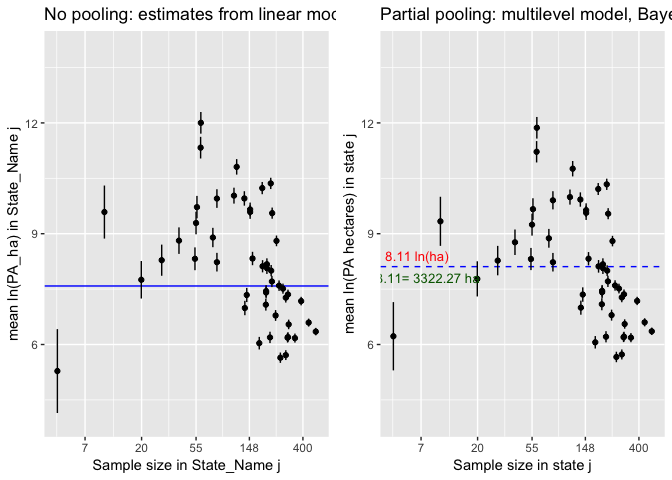
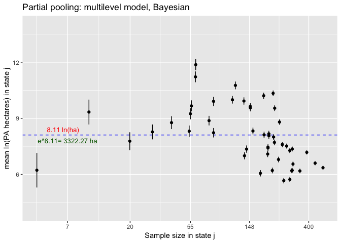

Conservation\_glm.R
================
Amy
Wed Oct 31 16:33:01 2018

``` r
library(ggplot2)
library(tidyr)
library(tidyverse)
```

    ## ── Attaching packages ────────────────────────────────────────────────────────── tidyverse 1.2.1 ──

    ## ✔ tibble  1.4.2     ✔ dplyr   0.7.6
    ## ✔ readr   1.1.1     ✔ stringr 1.3.1
    ## ✔ purrr   0.2.5     ✔ forcats 0.3.0

    ## ── Conflicts ───────────────────────────────────────────────────────────── tidyverse_conflicts() ──
    ## ✖ dplyr::filter() masks stats::filter()
    ## ✖ dplyr::lag()    masks stats::lag()

``` r
library(arm)
```

    ## Loading required package: MASS

    ## 
    ## Attaching package: 'MASS'

    ## The following object is masked from 'package:dplyr':
    ## 
    ##     select

    ## Loading required package: Matrix

    ## 
    ## Attaching package: 'Matrix'

    ## The following object is masked from 'package:tidyr':
    ## 
    ##     expand

    ## Loading required package: lme4

    ## 
    ## arm (Version 1.10-1, built: 2018-4-12)

    ## Working directory is /Users/Amy/Desktop/Data_science/git/Individual_project

``` r
library(gridExtra) #To allow arranging multiple plots
```

    ## 
    ## Attaching package: 'gridExtra'

    ## The following object is masked from 'package:dplyr':
    ## 
    ##     combine

``` r
library(dplyr)
library(rstan) #for extract function
```

    ## Loading required package: StanHeaders

    ## rstan (Version 2.17.3, GitRev: 2e1f913d3ca3)

    ## For execution on a local, multicore CPU with excess RAM we recommend calling
    ## options(mc.cores = parallel::detectCores()).
    ## To avoid recompilation of unchanged Stan programs, we recommend calling
    ## rstan_options(auto_write = TRUE)

    ## 
    ## Attaching package: 'rstan'

    ## The following object is masked from 'package:arm':
    ## 
    ##     traceplot

    ## The following object is masked from 'package:tidyr':
    ## 
    ##     extract

``` r
library(rstanarm)
```

    ## Loading required package: Rcpp

    ## rstanarm (Version 2.17.4, packaged: 2018-04-13 01:51:52 UTC)

    ## - Do not expect the default priors to remain the same in future rstanarm versions.

    ## Thus, R scripts should specify priors explicitly, even if they are just the defaults.

    ## - For execution on a local, multicore CPU with excess RAM we recommend calling

    ## options(mc.cores = parallel::detectCores())

    ## - Plotting theme set to bayesplot::theme_default().

``` r
options(mc.cores = parallel::detectCores())
theme_set(theme_grey()) #rstanarm overrides default ggplot theme: set it back


### Data Cleaning

Conservation_data<-read.csv("Conservation_data.csv",header=TRUE)
#names(Conservation_data)
dat<-Conservation_data[,c(1,2,3,5,6,11,13,15,17)]
head(dat)
```

    ##   County_ID_FIPS State_FIPS County_FIPS   County_Name    State_Name
    ## 1          25025         25          25       Suffolk Massachusetts
    ## 2           6075          6          75 San Francisco    California
    ## 3          35028         35          28    Los Alamos    New Mexico
    ## 4          51013         51          13     Arlington      Virginia
    ## 5          27123         27         123        Ramsey     Minnesota
    ## 6          22071         22          71       Orleans     Louisiana
    ##   Area_GapStatus1_PAs_ha Area_GapStatus2_PAs_ha Area_GapStatus3_PAs_ha
    ## 1                  0.000           6.207472e+04            16726.48159
    ## 2               6130.509           3.748194e+04            20888.93169
    ## 3               3950.024           4.856699e-01            15150.86564
    ## 4                  0.000           1.398152e+01               69.85727
    ## 5                  0.000           1.329744e+02             3811.05186
    ## 6              10156.619           2.569581e+02                0.00000
    ##   Area_GapStatus4_PAs_ha
    ## 1            1371.759112
    ## 2             612.651704
    ## 3           11241.495440
    ## 4             663.095872
    ## 5               1.731649
    ## 6             711.709482

``` r
#View(dat)
colnames(dat)[6:9]<-c("G1","G2","G3","G4") # To simplify and limit typing
head(dat)
```

    ##   County_ID_FIPS State_FIPS County_FIPS   County_Name    State_Name
    ## 1          25025         25          25       Suffolk Massachusetts
    ## 2           6075          6          75 San Francisco    California
    ## 3          35028         35          28    Los Alamos    New Mexico
    ## 4          51013         51          13     Arlington      Virginia
    ## 5          27123         27         123        Ramsey     Minnesota
    ## 6          22071         22          71       Orleans     Louisiana
    ##          G1           G2          G3           G4
    ## 1     0.000 6.207472e+04 16726.48159  1371.759112
    ## 2  6130.509 3.748194e+04 20888.93169   612.651704
    ## 3  3950.024 4.856699e-01 15150.86564 11241.495440
    ## 4     0.000 1.398152e+01    69.85727   663.095872
    ## 5     0.000 1.329744e+02  3811.05186     1.731649
    ## 6 10156.619 2.569581e+02     0.00000   711.709482

``` r
dat[,6:9]<-round(dat[,6:9],digits=3) # Any protected area with less than 0.001 hectares will become zero
dat[, 6:9][dat[, 6:9] == 0] <- NA # Zeros become NA to remove easily when stacked with melt
#head(dat)
```

Sanity check for when NA’s are removed. Calculating the NA’s for
Gap\_Status1:4 (columns 6:9)

``` r
n<-NULL
  for (i in 6:9) {
    n[i]<-length(dat[,i][!is.na(dat[,i])])
  }
  sum<-sum(n,na.rm=TRUE)
sum
```

    ## [1] 9327

Length should be:

``` r
Correct_length<-paste("Length Should Be:",sum)
Correct_length
```

    ## [1] "Length Should Be: 9327"

Stacking the data:

``` r
library(reshape2)
```

    ## 
    ## Attaching package: 'reshape2'

    ## The following object is masked from 'package:tidyr':
    ## 
    ##     smiths

``` r
dat1 <- melt(dat, id.vars=1:5, na.rm=TRUE, value.name="PA_ha")
head(dat1)
```

    ##    County_ID_FIPS State_FIPS County_FIPS   County_Name   State_Name
    ## 2            6075          6          75 San Francisco   California
    ## 3           35028         35          28    Los Alamos   New Mexico
    ## 6           22071         22          71       Orleans    Louisiana
    ## 7           34013         34          13         Essex   New Jersey
    ## 9           12103         12         103      Pinellas      Florida
    ## 10          42101         42         101  Philadelphia Pennsylvania
    ##    variable     PA_ha
    ## 2        G1  6130.509
    ## 3        G1  3950.024
    ## 6        G1 10156.619
    ## 7        G1   116.977
    ## 9        G1  7907.001
    ## 10       G1     9.856

``` r
#View(dat1)
names(dat1)
```

    ## [1] "County_ID_FIPS" "State_FIPS"     "County_FIPS"    "County_Name"   
    ## [5] "State_Name"     "variable"       "PA_ha"

``` r
colnames(dat1)[6]<-"Gap_Status"
head(dat1)
```

    ##    County_ID_FIPS State_FIPS County_FIPS   County_Name   State_Name
    ## 2            6075          6          75 San Francisco   California
    ## 3           35028         35          28    Los Alamos   New Mexico
    ## 6           22071         22          71       Orleans    Louisiana
    ## 7           34013         34          13         Essex   New Jersey
    ## 9           12103         12         103      Pinellas      Florida
    ## 10          42101         42         101  Philadelphia Pennsylvania
    ##    Gap_Status     PA_ha
    ## 2          G1  6130.509
    ## 3          G1  3950.024
    ## 6          G1 10156.619
    ## 7          G1   116.977
    ## 9          G1  7907.001
    ## 10         G1     9.856

``` r
length(dat1$Gap_Status)
```

    ## [1] 9327

``` r
Correct_length
```

    ## [1] "Length Should Be: 9327"

``` r
#View(dat1)
```

Truncating data at 1 hectare, because less than one is probably an error
or unimportant:

``` r
data<-filter(dat1, PA_ha>=1) # Sanity check
sc<-filter(dat1, PA_ha<1)
(length(data$PA_ha) + length(sc$PA_ha))==length(dat1$PA_ha)
```

    ## [1] TRUE

``` r
Correct_length2<-paste("Length Should Be:",length(data$PA_ha))
rm(data,sc) # Cleaning up
dat1<-filter(dat1, PA_ha>=1)
length(dat1$PA_ha)
```

    ## [1] 9165

``` r
Correct_length2
```

    ## [1] "Length Should Be: 9165"

Plots all states with hectares of protected area by gap status

``` r
dat1 %>%
  mutate(yjit=jitter(0*PA_ha)) %>%
  ggplot() +
  geom_point(mapping = aes(x=PA_ha,col=Gap_Status,y=yjit),shape=1,alpha=0.5) +
  facet_wrap(facets = ~ State_Name) +
  scale_x_continuous(breaks=c(0,20,40),limits=c(0,50)) +
  theme(axis.text.y=element_blank(),axis.ticks.y=element_blank(),
        axis.title.y=element_blank(),panel.grid=element_blank())
```

    ## Warning: Removed 8301 rows containing missing values (geom_point).

<!-- -->

How many samples per gap status?

``` r
n<-NULL
for (i in 1:4) {
  n[i]<-length(dat1$Gap_Status[dat1$Gap_Status==paste("G",i,sep="")])
}
names(n)<-c("G1","G2","G3","G4")
n
```

    ##   G1   G2   G3   G4 
    ## 1256 2793 2414 2702

``` r
head(dat1)
```

    ##   County_ID_FIPS State_FIPS County_FIPS   County_Name   State_Name
    ## 1           6075          6          75 San Francisco   California
    ## 2          35028         35          28    Los Alamos   New Mexico
    ## 3          22071         22          71       Orleans    Louisiana
    ## 4          34013         34          13         Essex   New Jersey
    ## 5          12103         12         103      Pinellas      Florida
    ## 6          42101         42         101  Philadelphia Pennsylvania
    ##   Gap_Status     PA_ha
    ## 1         G1  6130.509
    ## 2         G1  3950.024
    ## 3         G1 10156.619
    ## 4         G1   116.977
    ## 5         G1  7907.001
    ## 6         G1     9.856

``` r
dat1 %>%
  group_by(State_Name) %>%
  summarize(sample_size=n()) %>%
  arrange(-sample_size)
```

    ## # A tibble: 49 x 2
    ##    State_Name     sample_size
    ##    <fct>                <int>
    ##  1 Texas                  508
    ##  2 Georgia                445
    ##  3 Virginia               387
    ##  4 Illinois               345
    ##  5 Missouri               307
    ##  6 Kentucky               303
    ##  7 North Carolina         303
    ##  8 Ohio                   301
    ##  9 Indiana                291
    ## 10 Minnesota              291
    ## # ... with 39 more rows

We see 8 State with more than 300 protected areas sampled. Let’s extract
these (using `filter()`) to get a better sense of how area of PA
distributions within State might vary between State. We’ll also restrict
to data from the largest gap status =
    G2

``` r
names(dat1)
```

    ## [1] "County_ID_FIPS" "State_FIPS"     "County_FIPS"    "County_Name"   
    ## [5] "State_Name"     "Gap_Status"     "PA_ha"

``` r
lrgst8State_G2 <- dat1 %>%
  group_by(State_Name) %>%
  filter(n() > 300,Gap_Status=="G2")
```

Histograms for the eight states.

``` r
ggplot(data=lrgst8State_G2) +
  geom_histogram(mapping = aes(x=PA_ha,y=stat(density)),bins=36) +
  facet_wrap(facets = ~ State_Name)
```

<!-- -->

``` r
# All Gap statuses
names(dat1)
```

    ## [1] "County_ID_FIPS" "State_FIPS"     "County_FIPS"    "County_Name"   
    ## [5] "State_Name"     "Gap_Status"     "PA_ha"

``` r
lrgst8State_all <- dat1 %>%
  group_by(State_Name) %>%
  filter(n() > 300)
```

Histograms for the eight states.

``` r
ggplot(data=lrgst8State_all) +
  geom_histogram(mapping = aes(x=PA_ha,y=stat(density)),bins=36) +
  facet_wrap(facets = ~ State_Name)
```

<!-- -->

``` r
# pretty concentrated around small protected areas

# Overlapping histograms:
ggplot(data=lrgst8State_all) +
  geom_histogram(mapping = aes(x=PA_ha,y=stat(density),fill=State_Name),
                 position="identity",bins=36,alpha=0.6)
```

<!-- -->

``` r
#Density plot:
ggplot(data=lrgst8State_all) +
  geom_density(mapping = aes(x=PA_ha,col=State_Name))
```

<!-- -->

``` r
########## All those plots with log transformation:#########################
```

Histograms for the eight states.

``` r
ggplot(data=lrgst8State_all) +
  geom_histogram(mapping = aes(x=log(PA_ha),y=stat(density)),bins=36) +
  facet_wrap(facets = ~ State_Name)
```

<!-- -->

``` r
# Overlapping histograms:
ggplot(data=lrgst8State_all) +
  geom_histogram(mapping = aes(x=log(PA_ha),y=stat(density),fill=State_Name),
                 position="identity",bins=36,alpha=0.6)
```

<!-- -->

``` r
#Density plot:
ggplot(data=lrgst8State_all) +
  geom_density(mapping = aes(x=log(PA_ha),col=State_Name))
```

<!-- -->

``` r
# So, definitely want to log transform:
dat1<-mutate(dat1,log_PA_ha=log(PA_ha))
head(dat1)
```

    ##   County_ID_FIPS State_FIPS County_FIPS   County_Name   State_Name
    ## 1           6075          6          75 San Francisco   California
    ## 2          35028         35          28    Los Alamos   New Mexico
    ## 3          22071         22          71       Orleans    Louisiana
    ## 4          34013         34          13         Essex   New Jersey
    ## 5          12103         12         103      Pinellas      Florida
    ## 6          42101         42         101  Philadelphia Pennsylvania
    ##   Gap_Status     PA_ha log_PA_ha
    ## 1         G1  6130.509  8.721033
    ## 2         G1  3950.024  8.281477
    ## 3         G1 10156.619  9.225881
    ## 4         G1   116.977  4.761977
    ## 5         G1  7907.001  8.975504
    ## 6         G1     9.856  2.288080

Take a look at the transformed data in those 8 states First make a data
frame with the estimated normal distribution for the 8 states Summary
statistics for 8 states

``` r
summ8State <-
  dat1 %>%
  group_by(State_Name) %>%
  filter(n() > 300,Gap_Status=="G2") %>%
  summarize(mean=mean(log_PA_ha),sd=sd(log_PA_ha),min=min(log_PA_ha),max=max(log_PA_ha))
```

Normal fitted for 5 counties and collected into a dataframe.

``` r
norm_df <- NULL
for ( i in 1:8 ) {
  x <- seq(summ8State$min[i],summ8State$max[i],length.out = 100)
  y <- dnorm(x, summ8State$mean[i], summ8State$sd[i])
  norm_df <- rbind(norm_df,data.frame(x,y,State_Name=summ8State$State_Name[i]))
}
rm(x,y) #clean up
```

Now plot the transformed data with density smoother (blue) and fitted
normal (red). The log transformation seems very good:

``` r
dat1 %>%
  group_by(State_Name) %>%
  filter(n() > 300,Gap_Status=="G2") %>%
  ggplot() +
  geom_histogram(mapping = aes(x=log_PA_ha,y=stat(density)),bins=25) +
  geom_density(mapping = aes(x=log_PA_ha),col="blue") +
  geom_line(data=norm_df, mapping = aes(x=x,y=y),col="red") +
  facet_wrap(facets = ~ State_Name)
```

<!-- -->

And now for the whole dataset split by gap status It is simple to modify
the above code to group by gap status instead.

``` r
summ_byGap_Status <-
  dat1 %>%
  group_by(Gap_Status) %>%
  summarize(mean=mean(log_PA_ha),sd=sd(log_PA_ha),min=min(log_PA_ha),max=max(log_PA_ha))
```

Normal fitted for 4 Gap Statuses

``` r
norm_df <- NULL
for ( i in 1:4 ) {
  x <- seq(summ_byGap_Status$min[i],summ_byGap_Status$max[i],length.out = 100)
  y <- dnorm(x, summ_byGap_Status$mean[i], summ_byGap_Status$sd[i])
  norm_df <- rbind(norm_df,data.frame(x,y,Gap_Status=summ_byGap_Status$Gap_Status[i]))
}
rm(x,y)
```

Now plot the transformed data with density smoother (blue) and fitted
normal (red).

``` r
dat1 %>%
  group_by(Gap_Status) %>%
  ggplot() +
  geom_histogram(mapping = aes(x=log_PA_ha,y=stat(density)),bins=25) +
  geom_density(mapping = aes(x=log_PA_ha),col="blue") +
  geom_line(data=norm_df, mapping = aes(x=x,y=y),col="red") +
  facet_wrap(facets = ~ Gap_Status)
```

<!-- -->

``` r
# Log Transformation works well
```

Start by converting State\_Name to a factor

``` r
dat1 <- mutate(dat1,State_Name=factor(State_Name))
```

#### Complete pooling

In this case, complete pooling is just the overall mean. That is, we
omit any data structure or grouping variables.

``` r
poolmean <- mean(dat1$log_PA_ha)
poolmean
```

    ## [1] 7.584689

``` r
cp_pred_df <- data.frame(poolmean) #df for use with ggplot
```

#### No pooling

You can think of **no pooling** as separately calculating an estimate of
the mean for each State\_Name. For example, tabulate the means for each
State\_Name (and sd and se):

``` r
lnPA_mean_var <- 
  dat1 %>%
  group_by(State_Name) %>%
  summarize(sample_size=n(),ST_mn=mean(log_PA_ha),ST_sd=sd(log_PA_ha)) %>%
  mutate(ST_se=ST_sd/sqrt(sample_size)) %>%
  mutate(sample_size_jit=jitter(sample_size)) #jitter added for plotting
```

Looking at the whole result to check that everything makes sense and
scan for problems.

``` r
print(lnPA_mean_var,n=Inf) #n=Inf to print all rows
```

    ## # A tibble: 49 x 6
    ##    State_Name           sample_size ST_mn ST_sd ST_se sample_size_jit
    ##    <fct>                      <int> <dbl> <dbl> <dbl>           <dbl>
    ##  1 Alabama                      201  7.08  1.92 0.135          201.  
    ##  2 Arizona                       60 12.0   1.88 0.242           59.9 
    ##  3 Arkansas                     202  7.45  2.54 0.179          202.  
    ##  4 California                   220 10.4   2.05 0.138          220.  
    ##  5 Colorado                     226  9.56  2.42 0.161          226.  
    ##  6 Connecticut                   29  8.28  2.00 0.371           28.9 
    ##  7 Delaware                      10  9.59  2.44 0.771           10.2 
    ##  8 District of Columbia           4  5.28  2.90 1.45             4.17
    ##  9 Florida                      245  8.81  2.25 0.144          245.  
    ## 10 Georgia                      445  6.59  2.25 0.106          445.  
    ## 11 Idaho                        150  9.59  2.93 0.239          150.  
    ## 12 Illinois                     345  6.17  2.13 0.115          345.  
    ## 13 Indiana                      291  5.71  2.02 0.118          291.  
    ## 14 Iowa                         263  5.64  2.13 0.132          263.  
    ## 15 Kansas                       178  6.04  2.14 0.161          178.  
    ## 16 Kentucky                     303  6.20  2.07 0.119          303.  
    ## 17 Louisiana                    202  7.41  2.22 0.156          202.  
    ## 18 Maine                         56  9.72  2.47 0.330           56.0 
    ## 19 Maryland                      75  8.90  1.82 0.210           75.0 
    ## 20 Massachusetts                 55  9.29  1.85 0.249           54.9 
    ## 21 Michigan                     276  7.51  2.36 0.142          276.  
    ## 22 Minnesota                    291  7.27  2.76 0.162          291.  
    ## 23 Mississippi                  225  7.71  2.00 0.133          225.  
    ## 24 Missouri                     307  6.54  2.57 0.147          307.  
    ## 25 Montana                      188 10.2   2.35 0.171          188.  
    ## 26 Nebraska                     217  6.19  2.06 0.140          217.  
    ## 27 Nevada                        60 11.3   2.64 0.340           59.9 
    ## 28 New Hampshire                 40  8.81  1.99 0.314           40.1 
    ## 29 New Jersey                    81  8.23  1.96 0.218           81.2 
    ## 30 New Mexico                   117 10.8   2.14 0.198          117.  
    ## 31 New York                     205  8.07  2.08 0.145          205.  
    ## 32 North Carolina               303  7.36  2.35 0.135          303.  
    ## 33 North Dakota                 157  8.33  1.89 0.151          157.  
    ## 34 Ohio                         301  6.18  1.96 0.113          301.  
    ## 35 Oklahoma                     205  8.17  2.03 0.142          205.  
    ## 36 Oregon                       135  9.96  2.32 0.200          135.  
    ## 37 Pennsylvania                 257  7.59  2.09 0.130          257.  
    ## 38 Rhode Island                  20  7.75  2.56 0.572           20.1 
    ## 39 South Carolina               141  7.34  2.21 0.186          141.  
    ## 40 South Dakota                 189  8.12  2.32 0.169          189.  
    ## 41 Tennessee                    241  6.79  2.19 0.141          241.  
    ## 42 Texas                        508  6.35  2.58 0.115          508.  
    ## 43 Utah                         111 10.0   2.93 0.278          111.  
    ## 44 Vermont                       54  8.32  1.86 0.253           53.9 
    ## 45 Virginia                     387  7.18  2.35 0.120          387.  
    ## 46 Washington                   150  9.66  2.46 0.201          150.  
    ## 47 West Virginia                136  6.99  2.39 0.205          136.  
    ## 48 Wisconsin                    222  8.00  2.01 0.135          222.  
    ## 49 Wyoming                       81  9.95  2.87 0.319           81.0

``` r
#View(lnPA_mean_var)
ggplot(data=lnPA_mean_var) +
  geom_hline(mapping=aes(yintercept=poolmean),data=cp_pred_df,col="blue") +
  geom_point(mapping=aes(x=sample_size_jit,y=ST_mn)) +
  geom_linerange(mapping=aes(x=sample_size_jit,ymin=ST_mn-ST_se,ymax=ST_mn+ST_se)) +
  scale_x_continuous(trans="log",breaks=c(1,3,10,30,100)) +
  labs(x="Sample size in State j",y="mean ln(PA hectares) in State j",
       title="No pooling: separate analyses by State")
```

<!-- -->

``` r
#The blue line is the completely pooled estimate (the overall mean). Some of the standard
```

errors are large, because we have calculated them independently for each
state. The **no pooling** analysis for the state means. This analysis
does not pool information about the **means** but it does pool
information about the uncertainty (the error of each observation
contributes to an estimate of the mean residual error). This is
sometimes called the **fixed effects model**, where here `state` is the
fixed effect. To fit this model in a frequentist paradigm we can use
`lm()`, which is implicitly a GLM with Normal distribution and identity
link. We fit `state` as a categorical variable, which gives us estimated
means for each state where the maximum likelihood estimate is just the
mean of the within-state samples. We use the means parameterization (i.e
without the intercept, thus “-1”):

``` r
npfit <- lm( log_PA_ha ~ -1 + State_Name, data=dat1 )
```

Check the fitted model (diagnostic
plots)

``` r
plot(npfit,1:5,ask=FALSE)
```

<!-- --><!-- --><!-- --><!-- --><!-- -->

The extended left tail, including the 0 + 0.1 hack, is evident in the QQ
plot but otherwise the diagnostics look good. Let’s also look at a
residuals histogram compared to the Normal distribution:

``` r
r <- residuals(npfit)
x <- seq(min(r),max(r),length.out=100)
y <- dnorm(x,mean(r),sd(r))
res_df <- data.frame(residuals=r)
norm_df <- data.frame(x=x,y=y)
rm(r,x,y)
ggplot() +
  geom_histogram(mapping=aes(x=residuals,y=stat(density)),data=res_df,bins=60) +
  geom_line(mapping=aes(x=x,y=y),col="red",data=norm_df)
```

<!-- -->

So, Normal looks like a good approximation for the errors. Plot the
fitted
model.

``` r
np_pred_df <- data.frame(coef(summary(npfit))[,1:2],lnPA_mean_var$sample_size_jit)
names(np_pred_df) <- c("ST_mn","ST_se","sample_size_jit")
plotONE <- 
  ggplot(data=np_pred_df) +
  geom_hline(mapping=aes(yintercept=poolmean),data=cp_pred_df,col="blue") +
  geom_point(mapping=aes(x=sample_size_jit,y=ST_mn)) +
  geom_linerange(mapping=aes(x=sample_size_jit,ymin=ST_mn-ST_se,ymax=ST_mn+ST_se)) +
  scale_x_continuous(trans="log",breaks=c(1,3,10,30,100)) +
  ylim(4,14) +
  labs(x="Sample size in State_Name j",y="mean ln(PA_ha) in State_Name j",
       title="No pooling: estimates from linear model fit")
plotONE
```

<!-- -->

``` r
#The blue line is the complete pooling model (i.e. the overall mean).
```

#### Partial pooling & shrinkage in multilevel model

In the **complete pooling** model (i.e. the overall mean) we did not
include variation among states, while in the **no pooling** model, we
estimated the state means separately, whether literally by separate
analyses or in the fixed effects model. In the **partial pooling** model
the estimates for the mean in each state are a balance between the
information in a state sample and information from other states. To
achieve this, we formulate a **multilevel model**. In the multilevel
model we consider two levels for means: an overall mean and means for
states. Each of the two levels of these means has an associated
stochastic process so that there are two variance components, a
between-state variance associated with the overall mean and a
within-state variance associated with the state means. To fit this model
in a frequentist paradigm we can use `lmer()` from the package `lme4`.
This model is implicitly a generalized linear mixed model (GLMM) with
Normal distribution, identity link, and two levels of stochasticity:

``` r
ppfit <- lmer( log_PA_ha ~ 1 + (1|State_Name), REML=FALSE, data=dat1 )
```

The `1` part of the above model specifies the overall mean (the
intercept term) while the `+ (1|state)` part specifies that the
intercepts for each state should be random variables (more specifically
the deviations, or “random effects”, of state means from the overall
mean will be modeled as a Normally distributed random variable).
`REML=FALSE` says to fit by ordinary maximum likelihood rather than the
default residual maximum likelihood.

By default, we get limited diagnostics for `lmer()`. Just residuals vs
fitted. The residual plot looks good though. We will later explore some
other diagnostic options.

``` r
plot(ppfit)
```

<!-- -->

In the summary we now see estimates for two levels (or strata) of
variance, state (among states) and residual (among counties within
states):

``` r
summary(ppfit)
```

    ## Linear mixed model fit by maximum likelihood  ['lmerMod']
    ## Formula: log_PA_ha ~ 1 + (1 | State_Name)
    ##    Data: dat1
    ## 
    ##      AIC      BIC   logLik deviance df.resid 
    ##  41255.1  41276.5 -20624.6  41249.1     9162 
    ## 
    ## Scaled residuals: 
    ##     Min      1Q  Median      3Q     Max 
    ## -4.4342 -0.6280  0.1072  0.6952  3.0138 
    ## 
    ## Random effects:
    ##  Groups     Name        Variance Std.Dev.
    ##  State_Name (Intercept) 2.385    1.544   
    ##  Residual               5.157    2.271   
    ## Number of obs: 9165, groups:  State_Name, 49
    ## 
    ## Fixed effects:
    ##             Estimate Std. Error t value
    ## (Intercept)   8.0962     0.2238   36.18

Plot the fitted
model

``` r
pp_pred_df <- data.frame(coef(ppfit)$State_Name,se.ranef(ppfit)$State_Name[,1],lnPA_mean_var$sample_size_jit)
names(pp_pred_df) <- c("ST_mn","ST_se","sample_size_jit")
pp_mean_df <- data.frame(ovrl_mn=summary(ppfit)$coefficients[1],ovrl_se=summary(ppfit)$coefficients[2])
plotTWO <- 
  ggplot(data=pp_pred_df) +
  geom_hline(mapping=aes(yintercept=poolmean),data=cp_pred_df,col="blue") +
  geom_hline(mapping=aes(yintercept=ovrl_mn),data=pp_mean_df,col="blue",lty=2) +
  geom_point(mapping=aes(x=sample_size_jit,y=ST_mn)) +
  geom_linerange(mapping=aes(x=sample_size_jit,ymin=ST_mn-ST_se,ymax=ST_mn+ST_se)) +
  scale_x_continuous(trans="log",breaks=c(1,3,10,30,100)) +
  ylim(4,14) +
  labs(x="Sample size in State_Name j",y="mean ln(PA_ha) in State_Name j",
       title="Partial pooling: multilevel model, max likelihood")
plotTWO
```

<!-- -->

Add a reference point to no pooling and partial pooling plots

``` r
plotONE_ref <- plotONE + 
  geom_point(mapping=aes(x=sample_size_jit,y=ST_mn),data=np_pred_df[8,],pch=1,cex=10,col="red")


plotTWO_ref <- plotTWO + 
  geom_point(mapping=aes(x=sample_size_jit,y=ST_mn),data=pp_pred_df[8,],pch=1,cex=10,col="red")
```

Plot side by side

``` r
grid.arrange(plotONE_ref, plotTWO_ref, nrow = 1) 
```

<!-- -->

The right panel is the fitted multilevel model compared to our previous
fit of the no pooling model in the left panel. In the multilevel model
the estimates for the mean in each state are a balance between the
sample mean and the overall mean, depending on the within-state sample
size. That is, the information in a particular state is pooled with the
information from other states. You can see how this works by comparing
the multilevel (partial pooling) model in the right panel to the no
pooling model in the left panel. If there are more observations for a
given state, there is more information at the state level, so the
estimate of the state mean in the multilevel model remains close to the
sample mean. If there are fewer observations, information from the other
states will pull an estimate for a particular state toward the overall
mean, like state 8 (DC), which is circled in red. This is called
**shrinkage**. In this case, it moves upward when shrinking, because it
is lower than the overall mean. The other thing to note is the dashed
blue line. This is the estimated overall mean from the multilevel model,
which is also a balance of the information at different levels. You can
see that it is higher than simply the overall mean of the data (solid
blue line). \#\#\#\# Partial pooling, Bayesian fit of multilevel model
Compared to the maximum likelihood model we just fitted, this model had
flat priors for the three model parameters (overall mean and the two
variances). The Bayesian version of this model is accomplished easily
with ’ the `stan_glm()` function of `rstanarm`.

``` r
ppfit_bayes <- stan_lmer( log_PA_ha ~ 1 + (1|State_Name), data=dat1 )
print(summary(ppfit_bayes)[,c(1,3,9,10)],digits=3)
```

    ##                                                     mean     sd n_eff Rhat
    ## (Intercept)                                     8.10e+00 0.2346   103 1.06
    ## b[(Intercept) State_Name:Alabama]              -1.01e+00 0.2835   139 1.05
    ## b[(Intercept) State_Name:Arizona]               3.77e+00 0.3603   290 1.02
    ## b[(Intercept) State_Name:Arkansas]             -6.50e-01 0.2813   164 1.04
    ## b[(Intercept) State_Name:California]            2.24e+00 0.2782   147 1.04
    ## b[(Intercept) State_Name:Colorado]              1.44e+00 0.2781   146 1.04
    ## b[(Intercept) State_Name:Connecticut]           1.65e-01 0.4511   349 1.02
    ## b[(Intercept) State_Name:Delaware]              1.24e+00 0.6805  1047 1.01
    ## b[(Intercept) State_Name:District_of_Columbia] -1.83e+00 0.9489  1801 1.00
    ## b[(Intercept) State_Name:Florida]               6.96e-01 0.2717   140 1.04
    ## b[(Intercept) State_Name:Georgia]              -1.50e+00 0.2566   119 1.05
    ## b[(Intercept) State_Name:Idaho]                 1.46e+00 0.2980   168 1.04
    ## b[(Intercept) State_Name:Illinois]             -1.91e+00 0.2644   122 1.05
    ## b[(Intercept) State_Name:Indiana]              -2.37e+00 0.2693   131 1.05
    ## b[(Intercept) State_Name:Iowa]                 -2.44e+00 0.2731   135 1.05
    ## b[(Intercept) State_Name:Kansas]               -2.04e+00 0.2873   149 1.04
    ## b[(Intercept) State_Name:Kentucky]             -1.89e+00 0.2686   134 1.05
    ## b[(Intercept) State_Name:Louisiana]            -6.86e-01 0.2799   142 1.04
    ## b[(Intercept) State_Name:Maine]                 1.56e+00 0.3777   241 1.03
    ## b[(Intercept) State_Name:Maryland]              7.62e-01 0.3430   208 1.03
    ## b[(Intercept) State_Name:Massachusetts]         1.14e+00 0.3749   356 1.02
    ## b[(Intercept) State_Name:Michigan]             -5.86e-01 0.2721   129 1.05
    ## b[(Intercept) State_Name:Minnesota]            -8.27e-01 0.2680   132 1.05
    ## b[(Intercept) State_Name:Mississippi]          -3.93e-01 0.2815   152 1.04
    ## b[(Intercept) State_Name:Missouri]             -1.55e+00 0.2662   127 1.05
    ## b[(Intercept) State_Name:Montana]               2.11e+00 0.2836   161 1.04
    ## b[(Intercept) State_Name:Nebraska]             -1.89e+00 0.2785   143 1.04
    ## b[(Intercept) State_Name:Nevada]                3.12e+00 0.3725   230 1.03
    ## b[(Intercept) State_Name:New_Hampshire]         6.67e-01 0.4214   320 1.01
    ## b[(Intercept) State_Name:New_Jersey]            1.22e-01 0.3388   229 1.03
    ## b[(Intercept) State_Name:New_Mexico]            2.66e+00 0.3082   202 1.03
    ## b[(Intercept) State_Name:New_York]             -3.37e-02 0.2783   153 1.04
    ## b[(Intercept) State_Name:North_Carolina]       -7.43e-01 0.2669   130 1.05
    ## b[(Intercept) State_Name:North_Dakota]          2.19e-01 0.2913   155 1.04
    ## b[(Intercept) State_Name:Ohio]                 -1.90e+00 0.2672   128 1.05
    ## b[(Intercept) State_Name:Oklahoma]              6.77e-02 0.2783   147 1.04
    ## b[(Intercept) State_Name:Oregon]                1.82e+00 0.3035   184 1.03
    ## b[(Intercept) State_Name:Pennsylvania]         -5.08e-01 0.2737   138 1.04
    ## b[(Intercept) State_Name:Rhode_Island]         -3.48e-01 0.5261   577 1.01
    ## b[(Intercept) State_Name:South_Carolina]       -7.52e-01 0.3007   170 1.04
    ## b[(Intercept) State_Name:South_Dakota]          1.28e-02 0.2864   158 1.04
    ## b[(Intercept) State_Name:Tennessee]            -1.31e+00 0.2744   142 1.04
    ## b[(Intercept) State_Name:Texas]                -1.74e+00 0.2554   119 1.05
    ## b[(Intercept) State_Name:Utah]                  1.89e+00 0.3169   192 1.03
    ## b[(Intercept) State_Name:Vermont]               2.05e-01 0.3787   295 1.02
    ## b[(Intercept) State_Name:Virginia]             -9.24e-01 0.2606   124 1.05
    ## b[(Intercept) State_Name:Washington]            1.53e+00 0.2962   158 1.04
    ## b[(Intercept) State_Name:West_Virginia]        -1.10e+00 0.3005   171 1.04
    ## b[(Intercept) State_Name:Wisconsin]            -1.01e-01 0.2783   146 1.04
    ## b[(Intercept) State_Name:Wyoming]               1.81e+00 0.3347   222 1.03
    ## sigma                                           2.27e+00 0.0172  2779 1.00
    ## Sigma[State_Name:(Intercept),(Intercept)]       2.53e+00 0.5430   306 1.01
    ## mean_PPD                                        7.58e+00 0.0331  3411 1.00
    ## log-posterior                                  -2.06e+04 7.0980   464 1.00

Diagnostics

``` r
#launch_shinystan(ppfit_bayes)

########################## Here
```

Extract posterior samples

``` r
samples <- extract(ppfit_bayes$stanfit)
names(samples)
```

    ## [1] "alpha"    "b"        "aux"      "theta_L"  "mean_PPD" "lp__"

``` r
str(samples$alpha) #Samples of overall mean. Matrix: samples by row,  1 col, 4000 rows
```

    ##  num [1:4000, 1] 8.36 8.13 8.19 8.13 7.91 ...
    ##  - attr(*, "dimnames")=List of 2
    ##   ..$ iterations: NULL
    ##   ..$           : NULL

``` r
str(samples$b) #Samples of state deviations. Matrix: samples by row, 50 cols, 4000 rows
```

    ##  num [1:4000, 1:50] -1.246 -0.739 -1.101 -0.808 -0.95 ...
    ##  - attr(*, "dimnames")=List of 2
    ##   ..$ iterations: NULL
    ##   ..$           : NULL

Algorithm for posterior samples of the state means. We merely need to
add the samples for the overall mean (`alpha`) to the samples for the
state deviations (`b`).

``` r
State_samples <- samples$b[,1:49] * NA
for ( i in 1:49 ) {
  State_samples[,i] <- samples$b[,i] + samples$alpha
}

# Now calculate mean and standard deviation of the posterior distributions for
# the state means.
statepostmns <- rep(NA,49)
statepostses <- rep(NA,49)
for ( i in 1:49 ) {
  statepostmns[i] <- mean(State_samples[,i])
  statepostses[i] <- sd(State_samples[,i])
}
```

Plot of posterior means and standard
deviations

``` r
ppbayes_pred_df <- data.frame(statepostmns,statepostses,lnPA_mean_var$sample_size_jit)
names(ppbayes_pred_df) <- c("ST_mn","ST_se","sample_size_jit")
ppbayes_mean_df <- data.frame(ovrl_mn=mean(samples$alpha),ovrl_se=sd(samples$alpha))
plot_bayes <-
  ggplot(data=ppbayes_pred_df) +
  geom_hline(mapping=aes(yintercept=ovrl_mn),data=ppbayes_mean_df,col="blue",lty=2) +
  geom_point(mapping=aes(x=sample_size_jit,y=ST_mn)) +
  geom_linerange(mapping=aes(x=sample_size_jit,ymin=ST_mn-ST_se,ymax=ST_mn+ST_se)) +
  scale_x_continuous(trans="log",breaks=c(1,3,10,30,100)) +
  ylim(4,14) +
  labs(x="Sample size in state j",y="mean ln(PA hectares) in state j",
       title="Partial pooling: multilevel model, Bayesian")
grid.arrange(plotONE, plot_bayes, nrow = 1)
```

<!-- -->

``` r
plot_bayes
```

<!-- -->
