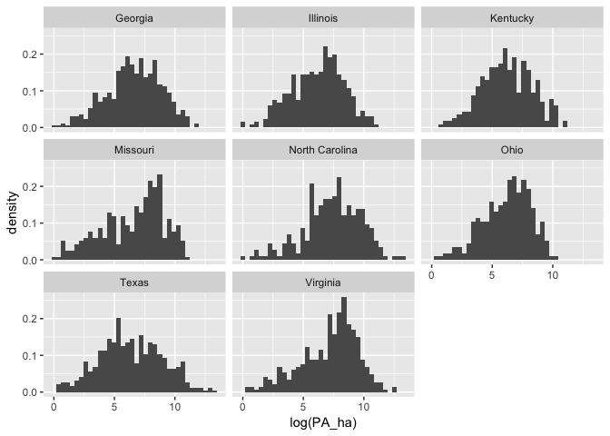

Conservation\_final.R
================
Amy
Fri Dec 21 02:05:02 2018

``` r
library(ggplot2)
library(dplyr)
```

    ## 
    ## Attaching package: 'dplyr'

    ## The following objects are masked from 'package:stats':
    ## 
    ##     filter, lag

    ## The following objects are masked from 'package:base':
    ## 
    ##     intersect, setdiff, setequal, union

``` r
library(tidyr)
library(tidyverse)
```

    ## ── Attaching packages ───────────────────────────────────────────── tidyverse 1.2.1 ──

    ## ✔ tibble  1.4.2     ✔ purrr   0.2.5
    ## ✔ readr   1.1.1     ✔ stringr 1.3.1
    ## ✔ tibble  1.4.2     ✔ forcats 0.3.0

    ## ── Conflicts ──────────────────────────────────────────────── tidyverse_conflicts() ──
    ## ✖ dplyr::filter() masks stats::filter()
    ## ✖ dplyr::lag()    masks stats::lag()

``` r
library(arm)
```

    ## Loading required package: MASS

    ## 
    ## Attaching package: 'MASS'

    ## The following object is masked from 'package:dplyr':
    ## 
    ##     select

    ## Loading required package: Matrix

    ## 
    ## Attaching package: 'Matrix'

    ## The following object is masked from 'package:tidyr':
    ## 
    ##     expand

    ## Loading required package: lme4

    ## 
    ## arm (Version 1.10-1, built: 2018-4-12)

    ## Working directory is /Users/Amy/Desktop/Data_science/git/Individual_project/Final_Codes_Grade_These_Please

``` r
library(gridExtra) #To allow arranging multiple plots
```

    ## 
    ## Attaching package: 'gridExtra'

    ## The following object is masked from 'package:dplyr':
    ## 
    ##     combine

``` r
library(rstan) #for extract function
```

    ## Loading required package: StanHeaders

    ## rstan (Version 2.17.3, GitRev: 2e1f913d3ca3)

    ## For execution on a local, multicore CPU with excess RAM we recommend calling
    ## options(mc.cores = parallel::detectCores()).
    ## To avoid recompilation of unchanged Stan programs, we recommend calling
    ## rstan_options(auto_write = TRUE)

    ## 
    ## Attaching package: 'rstan'

    ## The following object is masked from 'package:arm':
    ## 
    ##     traceplot

    ## The following object is masked from 'package:tidyr':
    ## 
    ##     extract

``` r
library(rstanarm)
```

    ## Loading required package: Rcpp

    ## rstanarm (Version 2.17.4, packaged: 2018-04-13 01:51:52 UTC)

    ## - Do not expect the default priors to remain the same in future rstanarm versions.

    ## Thus, R scripts should specify priors explicitly, even if they are just the defaults.

    ## - For execution on a local, multicore CPU with excess RAM we recommend calling

    ## options(mc.cores = parallel::detectCores())

    ## - Plotting theme set to bayesplot::theme_default().

``` r
library(reshape2)
```

    ## 
    ## Attaching package: 'reshape2'

    ## The following object is masked from 'package:tidyr':
    ## 
    ##     smiths

``` r
options(mc.cores = parallel::detectCores())
theme_set(theme_grey()) #rstanarm overrides default ggplot theme: set it back


## Data Cleaning
Conservation_data<-read.csv("Conservation_data.csv",header=TRUE)
names(Conservation_data)
```

    ##  [1] "County_ID_FIPS"                                       
    ##  [2] "State_FIPS"                                           
    ##  [3] "County_FIPS"                                          
    ##  [4] "County_ID_EXCEL"                                      
    ##  [5] "County_Name"                                          
    ##  [6] "State_Name"                                           
    ##  [7] "Area_of_County_ha"                                    
    ##  [8] "Lat_County_Centroid_Y"                                
    ##  [9] "Long_County_Centroid_X"                               
    ## [10] "Count_GapStatus1_PAs"                                 
    ## [11] "Area_GapStatus1_PAs_ha"                               
    ## [12] "Count_GapStatus2_PAs"                                 
    ## [13] "Area_GapStatus2_PAs_ha"                               
    ## [14] "Count_GapStatus3_PAs"                                 
    ## [15] "Area_GapStatus3_PAs_ha"                               
    ## [16] "Count_GapStatus4_PAs"                                 
    ## [17] "Area_GapStatus4_PAs_ha"                               
    ## [18] "Total_Count_PAs_GapStatus1_4"                         
    ## [19] "Total_Area_PAs_GapStatus1_4_ha"                       
    ## [20] "Tot_Land_Area_County_ha"                              
    ## [21] "Area_Name"                                            
    ## [22] "Area_Cropland_1997_ha"                                
    ## [23] "Area_Pasture_1997_ha"                                 
    ## [24] "Area_Forest_1997_ha"                                  
    ## [25] "Area_Urban_1997_ha"                                   
    ## [26] "Area_Range_1997_ha"                                   
    ## [27] "Area_Other_land_1997_ha"                              
    ## [28] "Total_Area_NonFed_Land_1997_ha"                       
    ## [29] "Urban_Area_2010_ha"                                   
    ## [30] "Forest_Area_2010_ha"                                  
    ## [31] "Cropland_Area_2010_ha"                                
    ## [32] "Pasture_Area_2010_ha"                                 
    ## [33] "Range_Area_2010_ha"                                   
    ## [34] "Urban_Area_2020_ha"                                   
    ## [35] "Forest_Area_2020_ha"                                  
    ## [36] "Cropland_Area_2020_ha"                                
    ## [37] "Pasture_Area_2020_ha"                                 
    ## [38] "Range_Area_2020_ha"                                   
    ## [39] "Urban_Area_2030_ha"                                   
    ## [40] "Forest_Area_2030_ha"                                  
    ## [41] "Cropland_Area_2030_ha"                                
    ## [42] "Pasture_Area_2030_ha"                                 
    ## [43] "Range_Area_2030_ha"                                   
    ## [44] "Urban_Area_2040_ha"                                   
    ## [45] "Forest_Area_2040_ha"                                  
    ## [46] "Cropland_Area_2040_ha"                                
    ## [47] "Pasture_Area_2040_ha"                                 
    ## [48] "Range_Area_2040_ha"                                   
    ## [49] "Urban_Area_2050_ha"                                   
    ## [50] "Forest_Area_2050_ha"                                  
    ## [51] "Cropland_Area_2050_ha"                                
    ## [52] "Pasture_Area_2050_ha"                                 
    ## [53] "Range_Area_2050_ha"                                   
    ## [54] "Urban_Area_2060_ha"                                   
    ## [55] "Forest_Area_2060_ha"                                  
    ## [56] "Cropland_Area_2060_ha"                                
    ## [57] "Pasture_Area_2060_ha"                                 
    ## [58] "Range_Area_2060_ha"                                   
    ## [59] "State"                                                
    ## [60] "County"                                               
    ## [61] "NASS_Area_Farms_2007_ha"                              
    ## [62] "NASS_Area_Farms_2012_ha"                              
    ## [63] "NASS_Farm_Count_2007"                                 
    ## [64] "NASS_Farm_Count_2012"                                 
    ## [65] "NASS_Avg_Area_ha_per_Farm_2007"                       
    ## [66] "NASS_Avg_Area_ha_per_Farm_2012"                       
    ## [67] "NASS_Avg_Net_Cash_Income_dol_per_Farm_2007"           
    ## [68] "NASS_Avg_Net_Cash_Income_dol_per_Farm_2012"           
    ## [69] "NASS_Net_Cash_Income_dol_2007"                        
    ## [70] "NASS_Net_Cash_Income_dol_2012"                        
    ## [71] "NASS_Ag_Land_Value_INCL_Buildings_dol_2007"           
    ## [72] "NASS_Ag_Land_Value_INCL_Buildings_dol_2012"           
    ## [73] "NASS_Avg_Ag_Land_Value_INCL_Buildings_dol_per_ha_2007"
    ## [74] "NASS_Avg_Ag_Land_Value_INCL_Buildings_dol_per_ha_2012"

``` r
dat<-Conservation_data[,c(1,2,3,5,6,11,13,15,17)]
head(dat)
```

    ##   County_ID_FIPS State_FIPS County_FIPS   County_Name    State_Name
    ## 1          25025         25          25       Suffolk Massachusetts
    ## 2           6075          6          75 San Francisco    California
    ## 3          35028         35          28    Los Alamos    New Mexico
    ## 4          51013         51          13     Arlington      Virginia
    ## 5          27123         27         123        Ramsey     Minnesota
    ## 6          22071         22          71       Orleans     Louisiana
    ##   Area_GapStatus1_PAs_ha Area_GapStatus2_PAs_ha Area_GapStatus3_PAs_ha
    ## 1                  0.000           6.207472e+04            16726.48159
    ## 2               6130.509           3.748194e+04            20888.93169
    ## 3               3950.024           4.856699e-01            15150.86564
    ## 4                  0.000           1.398152e+01               69.85727
    ## 5                  0.000           1.329744e+02             3811.05186
    ## 6              10156.619           2.569581e+02                0.00000
    ##   Area_GapStatus4_PAs_ha
    ## 1            1371.759112
    ## 2             612.651704
    ## 3           11241.495440
    ## 4             663.095872
    ## 5               1.731649
    ## 6             711.709482

``` r
colnames(dat)[6:9]<-c(1,2,3,4) # To simplify and limit typing
dat[,6:9]<-round(dat[,6:9],digits=3) # Any protected area with less than 0.001 hectares will become zero
dat[, 6:9][dat[, 6:9] == 0] <- NA # Zeros become NA to remove easily when stacked with melt
head(dat)
```

    ##   County_ID_FIPS State_FIPS County_FIPS   County_Name    State_Name
    ## 1          25025         25          25       Suffolk Massachusetts
    ## 2           6075          6          75 San Francisco    California
    ## 3          35028         35          28    Los Alamos    New Mexico
    ## 4          51013         51          13     Arlington      Virginia
    ## 5          27123         27         123        Ramsey     Minnesota
    ## 6          22071         22          71       Orleans     Louisiana
    ##           1         2         3         4
    ## 1        NA 62074.724 16726.482  1371.759
    ## 2  6130.509 37481.940 20888.932   612.652
    ## 3  3950.024     0.486 15150.866 11241.495
    ## 4        NA    13.982    69.857   663.096
    ## 5        NA   132.974  3811.052     1.732
    ## 6 10156.619   256.958        NA   711.709

Sanity check for when NA’s are removed. Calculating the NA’s for
Gap\_Status1:4 (columns 6:9)

``` r
n<-NULL
for (i in 6:9) {
  n[i]<-length(dat[,i][!is.na(dat[,i])])
}
sum<-sum(n,na.rm=TRUE)
sum
```

    ## [1] 9327

``` r
rm(n)
```

Length should be:

``` r
Correct_length<-paste("Length Should Be:",sum)
Correct_length
```

    ## [1] "Length Should Be: 9327"

Stacking the
data:

``` r
dat1 <- melt(dat, id.vars=1:5, na.rm=TRUE, value.name="PA_ha") # Data stacked by county identifiers. Gap Status columns now stacked into two columns: Gap Status type and hectares of protected area
colnames(dat1)[6]<-"Gap_Status"
head(dat1)
```

    ##    County_ID_FIPS State_FIPS County_FIPS   County_Name   State_Name
    ## 2            6075          6          75 San Francisco   California
    ## 3           35028         35          28    Los Alamos   New Mexico
    ## 6           22071         22          71       Orleans    Louisiana
    ## 7           34013         34          13         Essex   New Jersey
    ## 9           12103         12         103      Pinellas      Florida
    ## 10          42101         42         101  Philadelphia Pennsylvania
    ##    Gap_Status     PA_ha
    ## 2           1  6130.509
    ## 3           1  3950.024
    ## 6           1 10156.619
    ## 7           1   116.977
    ## 9           1  7907.001
    ## 10          1     9.856

``` r
length(dat1$Gap_Status)
```

    ## [1] 9327

``` r
Correct_length
```

    ## [1] "Length Should Be: 9327"

``` r
rm(sum,i,dat,Correct_length) # clean up
```

Truncating data at 1 hectare, because less than one is probably an error
or unimportant:

``` r
dat1<-filter(dat1, PA_ha>=1)
```

### Exploratory Data Analysis:

Plots all states with hectares of protected area by gap status

``` r
dat1 %>%
  mutate(yjit=jitter(0*PA_ha)) %>%
  ggplot() +
  geom_point(mapping = aes(x=PA_ha,col=Gap_Status,y=yjit),shape=1,alpha=0.5) +
  facet_wrap(facets = ~ State_Name) +
  scale_x_continuous(breaks=c(0,1000000,2000000),limits=c(0,3000000)) +
  theme(axis.text.y=element_blank(),axis.ticks.y=element_blank(),
        axis.title.y=element_blank(),panel.grid=element_blank())
```

    ## Warning: Removed 2 rows containing missing values (geom_point).

<!-- -->

How many samples are there per gap status?

``` r
percent<-NULL
for (i in 1:4) {
  percent[i]<-((length(dat1$Gap_Status[dat1$Gap_Status==i]))/length(dat1$Gap_Status))*100
}
names(percent)<-c("G1","G2","G3","G4")
count<-(percent/100)*length(dat1$County_ID_FIPS)
totals<-rbind(percent,count)
totals
```

    ##                 G1         G2         G3         G4
    ## percent   13.70431   30.47463   26.33933   29.48172
    ## count   1256.00000 2793.00000 2414.00000 2702.00000

``` r
rm(percent,count,i) # clean up

dat1 %>%
  group_by(State_Name) %>%
  summarize(sample_size=n()) %>%
  arrange(-sample_size)
```

    ## # A tibble: 49 x 2
    ##    State_Name     sample_size
    ##    <fct>                <int>
    ##  1 Texas                  508
    ##  2 Georgia                445
    ##  3 Virginia               387
    ##  4 Illinois               345
    ##  5 Missouri               307
    ##  6 Kentucky               303
    ##  7 North Carolina         303
    ##  8 Ohio                   301
    ##  9 Indiana                291
    ## 10 Minnesota              291
    ## # ... with 39 more rows

Eight states have more than 300 protected areas sampled. Extracting
these gives us an idea of how the distributions of protected area
hectares within state might vary between state. Data limited to the
largest gap status =
    G2

``` r
names(dat1)
```

    ## [1] "County_ID_FIPS" "State_FIPS"     "County_FIPS"    "County_Name"   
    ## [5] "State_Name"     "Gap_Status"     "PA_ha"

``` r
lrgst8State_G2 <- dat1 %>%
   group_by(State_Name) %>%
   filter(n() > 300,Gap_Status==2)
```

Histograms for the eight states.

``` r
 ggplot(data=lrgst8State_G2) +
   geom_histogram(mapping = aes(x=PA_ha,y=stat(density)),bins=36) +
   facet_wrap(facets = ~ State_Name)
```

<!-- -->

``` r
 #' Now Looking at All Gap statuses
  lrgst8State_all <- dat1 %>%
    group_by(State_Name) %>%
    filter(n() > 300)
```

Histograms for the eight states.

``` r
ggplot(data=lrgst8State_all) +
  geom_histogram(mapping = aes(x=PA_ha,y=stat(density)),bins=36) +
  facet_wrap(facets = ~ State_Name)
```

<!-- -->

``` r
 #' The data is pretty concentrated around small protected areas
```

Overlapping histograms:

``` r
ggplot(data=lrgst8State_all) +
   geom_histogram(mapping = aes(x=PA_ha,y=stat(density),fill=State_Name),
                  position="identity",bins=36,alpha=0.6)
```

<!-- -->

``` r
  # Not very helpful
```

Density plot:

``` r
ggplot(data=lrgst8State_all) +
   geom_density(mapping = aes(x=PA_ha,col=State_Name))
```

<!-- -->

``` r
# Again, this isn't very informative, but a log transformation seems like a good idea
```

All of those plots now with log transformation: Histograms for the eight
states.

``` r
ggplot(data=lrgst8State_all) +
   geom_histogram(mapping = aes(x=log(PA_ha),y=stat(density)),bins=36) +
   facet_wrap(facets = ~ State_Name)
```

<!-- -->

Overlapping histograms:

``` r
ggplot(data=lrgst8State_all) +
  geom_histogram(mapping = aes(x=log(PA_ha),y=stat(density),fill=State_Name),
                  position="identity",bins=36,alpha=0.6)
```

<!-- -->

Density plot:

``` r
ggplot(data=lrgst8State_all) +
   geom_density(mapping = aes(x=log(PA_ha),col=State_Name))
```

<!-- -->

``` r
# So, it definitely makes sense to log transform:
dat1<-mutate(dat1,log_PA_ha=log(PA_ha))
head(dat1)
```

    ##   County_ID_FIPS State_FIPS County_FIPS   County_Name   State_Name
    ## 1           6075          6          75 San Francisco   California
    ## 2          35028         35          28    Los Alamos   New Mexico
    ## 3          22071         22          71       Orleans    Louisiana
    ## 4          34013         34          13         Essex   New Jersey
    ## 5          12103         12         103      Pinellas      Florida
    ## 6          42101         42         101  Philadelphia Pennsylvania
    ##   Gap_Status     PA_ha log_PA_ha
    ## 1          1  6130.509  8.721033
    ## 2          1  3950.024  8.281477
    ## 3          1 10156.619  9.225881
    ## 4          1   116.977  4.761977
    ## 5          1  7907.001  8.975504
    ## 6          1     9.856  2.288080

Analysis with predictor (Gap\_Status) at the county level. County level"
means county **scale**. This is the spatial scale at which the predictor
applies. The predictor at the county level is *Gap\_Status* (G1:G4). \#’
Complete pooling: the overall regression mean. Omitting any data
structure or grouping variables:

``` r
poolfit <- lm(log_PA_ha ~ Gap_Status, data=dat1)
```

Diagnostic
Plots:

``` r
plot(poolfit,1:5,ask=FALSE)
```

<!-- --><!-- --><!-- --><!-- --><!-- -->

No major problems, but the it is important to note the tails of the Q-Q
plot

``` r
summary(poolfit)
```

    ## 
    ## Call:
    ## lm(formula = log_PA_ha ~ Gap_Status, data = dat1)
    ## 
    ## Residuals:
    ##     Min      1Q  Median      3Q     Max 
    ## -8.0672 -1.7336  0.1476  1.7758  7.9330 
    ## 
    ## Coefficients:
    ##             Estimate Std. Error t value Pr(>|t|)    
    ## (Intercept)  6.93422    0.07412  93.552   <2e-16 ***
    ## Gap_Status2  0.80196    0.08924   8.986   <2e-16 ***
    ## Gap_Status3  1.29589    0.09139  14.180   <2e-16 ***
    ## Gap_Status4  0.21960    0.08971   2.448   0.0144 *  
    ## ---
    ## Signif. codes:  0 '***' 0.001 '**' 0.01 '*' 0.05 '.' 0.1 ' ' 1
    ## 
    ## Residual standard error: 2.627 on 9161 degrees of freedom
    ## Multiple R-squared:  0.03219,    Adjusted R-squared:  0.03188 
    ## F-statistic: 101.6 on 3 and 9161 DF,  p-value: < 2.2e-16

The `(Intercept)` is the estimated mean log hectares of protected area
for Gap Status 1 (6.93). The slope `Gap_Status_2` (or \(\beta_1\))
estimates how log hectares of protected area in the Gap Status 2 differ
from Gap Status 1. Gap Status 2 on average has log\_PA\_ha 0.8
**higher** than Gap Status 1. Saving \(\beta\)s in dataframe for use
with
ggplot:

``` r
cp_pred_df <- data.frame(ovrl_b0=coef(poolfit)[1],ovrl_b1=coef(poolfit)[2]) # overall slope and intercept
```

No pooling: Mean hectares of protected area to will vary among states
but the relationship between the Gap\_Statuses (the slope) stays the
same among states. This is the **fixed effects** model, similar to the
analysis without the *Gap\_Status* predictor, but now `Gap_Status_x` is
included. This uses the means parameterization (i.e. -1) to remove the
overall intercept, which by default would arbitrarily be the log
hectares of protected area of Gap Status 1 of the first State.

``` r
npfit <- lm( log_PA_ha ~ -1 + State_Name, data=dat1 )
plot(npfit,1:5,ask=FALSE)
```

<!-- --><!-- --><!-- --><!-- --><!-- -->

The leverage plot is a bit concerning, but I’ll move on for now.

``` r
summary(npfit)
```

    ## 
    ## Call:
    ## lm(formula = log_PA_ha ~ -1 + State_Name, data = dat1)
    ## 
    ## Residuals:
    ##      Min       1Q   Median       3Q      Max 
    ## -10.0944  -1.4269   0.2418   1.5752   6.8517 
    ## 
    ## Coefficients:
    ##                                Estimate Std. Error t value Pr(>|t|)    
    ## State_NameAlabama                7.0781     0.1602  44.188  < 2e-16 ***
    ## State_NameArizona               12.0021     0.2932  40.938  < 2e-16 ***
    ## State_NameArkansas               7.4469     0.1598  46.606  < 2e-16 ***
    ## State_NameCalifornia            10.3619     0.1531  67.677  < 2e-16 ***
    ## State_NameColorado               9.5567     0.1511  63.264  < 2e-16 ***
    ## State_NameConnecticut            8.2830     0.4217  19.642  < 2e-16 ***
    ## State_NameDelaware               9.5862     0.7181  13.349  < 2e-16 ***
    ## State_NameDistrict of Columbia   5.2810     1.1355   4.651 3.35e-06 ***
    ## State_NameFlorida                8.8056     0.1451  60.693  < 2e-16 ***
    ## State_NameGeorgia                6.5932     0.1077  61.244  < 2e-16 ***
    ## State_NameIdaho                  9.5875     0.1854  51.706  < 2e-16 ***
    ## State_NameIllinois               6.1739     0.1223  50.497  < 2e-16 ***
    ## State_NameIndiana                5.7126     0.1331  42.912  < 2e-16 ***
    ## State_NameIowa                   5.6425     0.1400  40.294  < 2e-16 ***
    ## State_NameKansas                 6.0359     0.1702  35.461  < 2e-16 ***
    ## State_NameKentucky               6.2010     0.1305  47.530  < 2e-16 ***
    ## State_NameLouisiana              7.4069     0.1598  46.356  < 2e-16 ***
    ## State_NameMaine                  9.7203     0.3035  32.031  < 2e-16 ***
    ## State_NameMaryland               8.8969     0.2622  33.928  < 2e-16 ***
    ## State_NameMassachusetts          9.2900     0.3062  30.338  < 2e-16 ***
    ## State_NameMichigan               7.5120     0.1367  54.954  < 2e-16 ***
    ## State_NameMinnesota              7.2689     0.1331  54.602  < 2e-16 ***
    ## State_NameMississippi            7.7062     0.1514  50.901  < 2e-16 ***
    ## State_NameMissouri               6.5440     0.1296  50.490  < 2e-16 ***
    ## State_NameMontana               10.2350     0.1656  61.796  < 2e-16 ***
    ## State_NameNebraska               6.1921     0.1542  40.166  < 2e-16 ***
    ## State_NameNevada                11.3295     0.2932  38.644  < 2e-16 ***
    ## State_NameNew Hampshire          8.8123     0.3591  24.542  < 2e-16 ***
    ## State_NameNew Jersey             8.2292     0.2523  32.613  < 2e-16 ***
    ## State_NameNew Mexico            10.8100     0.2099  51.489  < 2e-16 ***
    ## State_NameNew York               8.0686     0.1586  50.871  < 2e-16 ***
    ## State_NameNorth Carolina         7.3552     0.1305  56.378  < 2e-16 ***
    ## State_NameNorth Dakota           8.3286     0.1812  45.953  < 2e-16 ***
    ## State_NameOhio                   6.1842     0.1309  47.245  < 2e-16 ***
    ## State_NameOklahoma               8.1746     0.1586  51.539  < 2e-16 ***
    ## State_NameOregon                 9.9551     0.1955  50.934  < 2e-16 ***
    ## State_NamePennsylvania           7.5933     0.1417  53.603  < 2e-16 ***
    ## State_NameRhode Island           7.7526     0.5078  15.267  < 2e-16 ***
    ## State_NameSouth Carolina         7.3409     0.1912  38.384  < 2e-16 ***
    ## State_NameSouth Dakota           8.1185     0.1652  49.147  < 2e-16 ***
    ## State_NameTennessee              6.7859     0.1463  46.388  < 2e-16 ***
    ## State_NameTexas                  6.3495     0.1008  63.018  < 2e-16 ***
    ## State_NameUtah                  10.0305     0.2155  46.535  < 2e-16 ***
    ## State_NameVermont                8.3206     0.3090  26.924  < 2e-16 ***
    ## State_NameVirginia               7.1755     0.1154  62.158  < 2e-16 ***
    ## State_NameWashington             9.6578     0.1854  52.086  < 2e-16 ***
    ## State_NameWest Virginia          6.9878     0.1947  35.884  < 2e-16 ***
    ## State_NameWisconsin              8.0001     0.1524  52.488  < 2e-16 ***
    ## State_NameWyoming                9.9518     0.2523  39.440  < 2e-16 ***
    ## ---
    ## Signif. codes:  0 '***' 0.001 '**' 0.01 '*' 0.05 '.' 0.1 ' ' 1
    ## 
    ## Residual standard error: 2.271 on 9116 degrees of freedom
    ## Multiple R-squared:  0.9207, Adjusted R-squared:  0.9202 
    ## F-statistic:  2159 on 49 and 9116 DF,  p-value: < 2.2e-16

The slope (`Gap_Status 1`, or \(\beta_1\)) estimate is similar the
complete pooling model. The difference is due to the new variable
(*State\_Name*) in the model. The new estimate is made after adjusting
for hectares of protected area levels among states. The `State_Name`
estimates are the mean hectares of protected area of Gap Status 1 for
each State. In this parameterization, the `State_Name` estimates are the
y-intercept for each State. Plot the fitted model for 8 selected states

``` r
np_pred_df <- data.frame(coef(summary(npfit))[,1:2],
                          Slope=rep(coef(npfit)[1],49))

head(np_pred_df)
```

    ##                        Estimate Std..Error    Slope
    ## State_NameAlabama      7.078067  0.1601804 7.078067
    ## State_NameArizona     12.002133  0.2931783 7.078067
    ## State_NameArkansas     7.446890  0.1597835 7.078067
    ## State_NameCalifornia  10.361906  0.1531074 7.078067
    ## State_NameColorado     9.556738  0.1510613 7.078067
    ## State_NameConnecticut  8.282952  0.4217048 7.078067

``` r
SN<-row.names(np_pred_df)
SN2<-sapply(strsplit(SN, split='State_Name', fixed=TRUE), `[`, 2) ## Output a vector (even though a list is also a vector)
head(SN2)
```

    ## [1] "Alabama"     "Arizona"     "Arkansas"    "California"  "Colorado"   
    ## [6] "Connecticut"

``` r
np_pred_df <- data.frame(np_pred_df, SN2)
names(np_pred_df) <- c("st_b0","st_b0_se","b1","State_Name")
head(np_pred_df)
```

    ##                           st_b0  st_b0_se       b1  State_Name
    ## State_NameAlabama      7.078067 0.1601804 7.078067     Alabama
    ## State_NameArizona     12.002133 0.2931783 7.078067     Arizona
    ## State_NameArkansas     7.446890 0.1597835 7.078067    Arkansas
    ## State_NameCalifornia  10.361906 0.1531074 7.078067  California
    ## State_NameColorado     9.556738 0.1510613 7.078067    Colorado
    ## State_NameConnecticut  8.282952 0.4217048 7.078067 Connecticut

``` r
display8 <- c("Georgia","Illinois","Iowa","Missouri","North Carolina","Ohio","Texas","Virginia")

dat1$Gap_Status<-as.numeric(dat1$Gap_Status)
str(dat1)
```

    ## 'data.frame':    9165 obs. of  8 variables:
    ##  $ County_ID_FIPS: int  6075 35028 22071 34013 12103 42101 25001 53035 12087 34031 ...
    ##  $ State_FIPS    : int  6 35 22 34 12 42 25 53 12 34 ...
    ##  $ County_FIPS   : int  75 28 71 13 103 101 1 35 87 31 ...
    ##  $ County_Name   : Factor w/ 1805 levels "Abbeville","Acadia",..: 1419 962 1203 545 1275 1264 99 877 1092 1237 ...
    ##  $ State_Name    : Factor w/ 49 levels "Alabama","Arizona",..: 4 30 17 29 9 37 20 46 9 29 ...
    ##  $ Gap_Status    : num  1 1 1 1 1 1 1 1 1 1 ...
    ##  $ PA_ha         : num  6131 3950 10157 117 7907 ...
    ##  $ log_PA_ha     : num  8.72 8.28 9.23 4.76 8.98 ...

``` r
dat1 %>%
   filter(State_Name %in% display8) %>%
   ggplot() +
   geom_abline(mapping=aes(slope=b1,intercept=st_b0),
               data=filter(np_pred_df,State_Name %in% display8),
               col="blue") +
   geom_point(mapping=aes(x=jitter(Gap_Status),y=log_PA_ha)) +
   #scale_x_continuous(breaks=c(0,1)) +
  facet_wrap(facets = ~ State_Name,ncol=4) +
  labs(x="Gap_Status",
        y="ln(PA_ha)",
        title="No pooling: estimates from linear model fit")
```

<!-- -->

The slope (measuring the difference in hectares of protected area
between Gap\_Statuses) is the same across states but the estimated
intercept differs. Plot the estimated intercepts: Saving this plot to
compare to the partial pooling model. Need a jittered sample-size
variable for plotting.

``` r
sample_size_df <- 
   dat1 %>%
   group_by(State_Name) %>%
   summarize(sample_size=n()) %>%
   mutate(sample_size_jit=jitter(sample_size)) #jitter added for plotting
np_pred_df <- cbind(np_pred_df,sample_size_df[,-1])
head(np_pred_df)
```

    ##                           st_b0  st_b0_se       b1  State_Name sample_size
    ## State_NameAlabama      7.078067 0.1601804 7.078067     Alabama         201
    ## State_NameArizona     12.002133 0.2931783 7.078067     Arizona          60
    ## State_NameArkansas     7.446890 0.1597835 7.078067    Arkansas         202
    ## State_NameCalifornia  10.361906 0.1531074 7.078067  California         220
    ## State_NameColorado     9.556738 0.1510613 7.078067    Colorado         226
    ## State_NameConnecticut  8.282952 0.4217048 7.078067 Connecticut          29
    ##                       sample_size_jit
    ## State_NameAlabama           201.14429
    ## State_NameArizona            59.89051
    ## State_NameArkansas          201.94968
    ## State_NameCalifornia        219.93706
    ## State_NameColorado          225.84402
    ## State_NameConnecticut        28.83615

``` r
No_Pooling_Plot <- 
   ggplot(data=np_pred_df) +
   geom_hline(mapping=aes(yintercept=ovrl_b0),data=cp_pred_df,col="blue") +
   geom_point(mapping=aes(x=sample_size_jit,y=st_b0)) +
   geom_linerange(mapping=aes(x=sample_size_jit,ymin=st_b0-st_b0_se,ymax=st_b0+st_b0_se)) +
  scale_x_continuous(trans="log",breaks=c(1,10,30,100,500)) +
  labs(x="Sample size in State_Name j",y="Estimated intercept in State_Name j",
        title="No pooling: estimates from linear model fit")
No_Pooling_Plot
```

<!-- -->

#### Partial pooling: multilevel model

In the multilevel model, the variation among states is modelled in the
intercept:

``` r
ppfit <- lmer( log_PA_ha ~ Gap_Status + (1|State_Name), REML=FALSE, data=dat1 )
```

The deviations of the State intercept from the mean intercept will be
modeled as a Normally distributed random variable. Residual plot looks
fine:

``` r
plot(ppfit)
```

<!-- -->

Examine the parameter estimates:

``` r
summary(ppfit)
```

    ## Linear mixed model fit by maximum likelihood  ['lmerMod']
    ## Formula: log_PA_ha ~ Gap_Status + (1 | State_Name)
    ##    Data: dat1
    ## 
    ##      AIC      BIC   logLik deviance df.resid 
    ##  41255.9  41284.4 -20624.0  41247.9     9161 
    ## 
    ## Scaled residuals: 
    ##     Min      1Q  Median      3Q     Max 
    ## -4.4261 -0.6274  0.1067  0.6946  3.0369 
    ## 
    ## Random effects:
    ##  Groups     Name        Variance Std.Dev.
    ##  State_Name (Intercept) 2.387    1.545   
    ##  Residual               5.157    2.271   
    ## Number of obs: 9165, groups:  State_Name, 49
    ## 
    ## Fixed effects:
    ##             Estimate Std. Error t value
    ## (Intercept)  8.02796    0.23248   34.53
    ## Gap_Status   0.02535    0.02326    1.09
    ## 
    ## Correlation of Fixed Effects:
    ##            (Intr)
    ## Gap_Status -0.269

As in the model without a predictor, in the summary under `Random
effects` there are now estimates for two levels (or scales) of variance,
`State_Name` (among states) and `Residual` (among counties within
states). Under `Fixed effects` we have the estimate for the common slope
`Gap_Status_x`, while the `(Intercept)` is the estimated mean hectares
of protected area at the State scale. \#’ \#’ Plot the fitted model
(G\&H Fig. 12.4) for 8 selected states

``` r
pp_pred_df <- data.frame(coef(ppfit)$State_Name,
                         se.ranef(ppfit)$State_Name[,1],
                         sample_size_df$sample_size_jit,
                         unique(dat1$State_Name))
names(pp_pred_df) <- c("st_b0","b1","st_b0_se","sample_size_jit","State_Name")
pp_mean_df <- data.frame(ovrl_b0=fixef(ppfit)[1],
                         ovrl_b1=fixef(ppfit)[2])
dat1 %>%
  filter(State_Name %in% display8) %>%
  ggplot() +
  #no pooling line
  geom_abline(mapping=aes(slope=b1,intercept=st_b0),
              data=filter(np_pred_df,State_Name %in% display8),
              col="blue") +
  #partial pooling line
  geom_abline(mapping=aes(slope=b1,intercept=st_b0),
              data=filter(pp_pred_df,State_Name %in% display8),
              col="blue",
              lty=2) +
  #complete pooling line
  geom_abline(mapping=aes(slope=ovrl_b1,intercept=ovrl_b0),
              data=cp_pred_df,
              col="red") +
  #data
  geom_point(mapping=aes(x=jitter(Gap_Status,0.2),y=log_PA_ha)) +
  facet_wrap(facets = ~ State_Name,ncol=4) +
  labs(x="Gap_Status",y="ln(PA_ha)",
       title="Partial pooling (dashed): multilevel model, max likelihood estimates")
```

<!-- -->

Partial pooling estimates (dashed blue line) compared to the no pooling
estimates (solid blue line), and the complete pooling estimate (red
line).

``` r
#Plot the the estimated intercepts 
```

Plot for partial pooling estimates:

``` r
Partial_Pooling_Plot <-
  ggplot(data=pp_pred_df) +
  geom_hline(mapping=aes(yintercept=ovrl_b0),
             data=cp_pred_df,
             col="blue") +
  geom_hline(mapping=aes(yintercept=ovrl_b0),
             data=pp_mean_df,
             col="blue",
             lty=2) +
  geom_point(mapping=aes(x=sample_size_jit,y=st_b0)) +
  geom_linerange(mapping=aes(x=sample_size_jit,
                             ymin=st_b0-st_b0_se,
                             ymax=st_b0+st_b0_se)) +
  scale_x_continuous(trans="log",breaks=c(1,10,30,100,500)) +
  #ylim(-0.1,3.5) +
  labs(x="Sample size in State_Name j",
       y="Estimated intercept in State_Name j",
       title="Partial pooling: multilevel model, max likelihood")
Partial_Pooling_Plot
```

<!-- -->

``` r
No_Pooling_Plot_ref <- No_Pooling_Plot + 
  geom_point(mapping=aes(x=sample_size_jit,y=st_b0),data=np_pred_df[8,],pch=1,cex=10,col="red")
Partial_Pooling_Plot_ref <- Partial_Pooling_Plot + 
  geom_point(mapping=aes(x=sample_size_jit,y=st_b0),data=pp_pred_df[8,],pch=1,cex=10,col="red")
```

Plot no pooling vs partial pooling side by side

``` r
grid.arrange(No_Pooling_Plot_ref, Partial_Pooling_Plot_ref, nrow = 1)
```

<!-- -->

The estimates for the State intercepts are shrunk toward the State-scale
mean (dashed blue line). The State-scale mean is the mean intercept
among states estimated by the multilevel model. The State mean is higher
than the complete pooling intercept (solid blue line), because the
complete pooling intercept is influenced by the most-sampled states. The
complete pooling estimate is weighted by the number of samples in a
State, whereas the partial pooling estimate is not. \#\#\#\# Multilevel
Model with State-Level Predictor: GDP

``` r
gdp<-read.csv("State_GDP.csv")
gdp$logGDP <- log(gdp$GDP_md)
head(gdp)
```

    ##    State_Name  GDP_md   logGDP
    ## 1     Alabama  210954 12.25940
    ## 2     Arizona  319850 12.67561
    ## 3    Arkansas  124918 11.73541
    ## 4  California 2746873 14.82597
    ## 5    Colorado  342748 12.74475
    ## 6 Connecticut  260827 12.47161

``` r
for ( i in 1:nrow(dat1) ) {
  dat1$logGDP[i] <- gdp$logGDP[gdp$State_Name==dat1$State_Name[i]]
}
dat1[sample(1:nrow(dat1),50),]
```

    ##      County_ID_FIPS State_FIPS County_FIPS County_Name     State_Name
    ## 4523          27163         27         163  Washington      Minnesota
    ## 7142          55035         55          35  Eau Claire      Wisconsin
    ## 6789           1127          1         127      Walker        Alabama
    ## 8767          48197         48         197    Hardeman          Texas
    ## 3810          56021         56          21     Laramie        Wyoming
    ## 4117          21111         21         111   Jefferson       Kentucky
    ## 4948          13207         13         207      Monroe        Georgia
    ## 6679          42089         42          89      Monroe   Pennsylvania
    ## 7029          47169         47         169   Trousdale      Tennessee
    ## 8322          45027         45          27   Clarendon South Carolina
    ## 8357          45049         45          49     Hampton South Carolina
    ## 7992          13075         13          75        Cook        Georgia
    ## 8511          37139         37         139  Pasquotank North Carolina
    ## 3354          45069         45          69    Marlboro South Carolina
    ## 2596          26129         26         129      Ogemaw       Michigan
    ## 1960          55123         55         123      Vernon      Wisconsin
    ## 8066           5121          5         121    Randolph       Arkansas
    ## 7748           1107          1         107     Pickens        Alabama
    ## 4543          28067         28          67       Jones    Mississippi
    ## 4214          13139         13         139        Hall        Georgia
    ## 7480          18183         18         183     Whitley        Indiana
    ## 4972          55101         55         101      Racine      Wisconsin
    ## 79             6037          6          37 Los Angeles     California
    ## 1359          37199         37         199      Yancey North Carolina
    ## 1347          17031         17          31        Cook       Illinois
    ## 4421          39053         39          53      Gallia           Ohio
    ## 8721          48411         48         411    San Saba          Texas
    ## 4327          37197         37         197      Yadkin North Carolina
    ## 2447          21031         21          31      Butler       Kentucky
    ## 575           13103         13         103   Effingham        Georgia
    ## 8434          13321         13         321       Worth        Georgia
    ## 5463          28089         28          89     Madison    Mississippi
    ## 1563          42025         42          25      Carbon   Pennsylvania
    ## 932           17011         17          11      Bureau       Illinois
    ## 4816           8077          8          77        Mesa       Colorado
    ## 8319          13033         13          33       Burke        Georgia
    ## 8696          27119         27         119        Polk      Minnesota
    ## 2337          22043         22          43       Grant      Louisiana
    ## 5173          40001         40           1       Adair       Oklahoma
    ## 2115          51135         51         135    Nottoway       Virginia
    ## 6814           6065          6          65   Riverside     California
    ## 6706          37009         37           9        Ashe North Carolina
    ## 6535          51199         51         199        York       Virginia
    ## 2211          48091         48          91       Comal          Texas
    ## 2491          26067         26          67       Ionia       Michigan
    ## 3498          48131         48         131       Duval          Texas
    ## 3733           8075          8          75       Logan       Colorado
    ## 5915           8119          8         119      Teller       Colorado
    ## 641           22113         22         113   Vermilion      Louisiana
    ## 7233          36027         36          27    Dutchess       New York
    ##      Gap_Status      PA_ha log_PA_ha   logGDP
    ## 4523          3   4352.732  8.378559 12.76886
    ## 7142          4    397.923  5.986259 12.68869
    ## 6789          4   6615.273  8.797136 12.25940
    ## 8767          4      7.310  1.989243 14.34390
    ## 3810          2  14696.182  9.595343 10.60376
    ## 4117          3    911.615  6.815218 12.21853
    ## 4948          3    100.701  4.612156 13.22541
    ## 6679          4  10428.921  9.252338 13.53059
    ## 7029          4   2164.836  7.680100 12.75193
    ## 8322          4    285.341  5.653685 12.29725
    ## 8357          4    318.152  5.762529 12.29725
    ## 7992          4    229.475  5.435794 13.22541
    ## 8511          4    311.156  5.740294 13.19615
    ## 3354          2    338.603  5.824828 12.29725
    ## 2596          2  11450.095  9.345753 13.13225
    ## 1960          2   7122.740  8.871048 12.68869
    ## 8066          4     64.636  4.168772 11.73541
    ## 7748          4   1507.230  7.318029 12.25940
    ## 4543          3  13424.728  9.504854 11.62363
    ## 4214          3     28.424  3.347234 13.22541
    ## 7480          4    148.165  4.998327 12.79142
    ## 4972          3    231.721  5.445534 12.68869
    ## 79            1  56324.269 10.938881 14.82597
    ## 1359          2   1334.905  7.196615 13.19615
    ## 1347          2    409.254  6.014336 13.61750
    ## 4421          3  10638.115  9.272199 13.38338
    ## 8721          4     47.408  3.858791 14.34390
    ## 4327          3    337.853  5.822611 13.19615
    ## 2447          2    164.295  5.101664 12.21853
    ## 575           1    347.921  5.851975 13.22541
    ## 8434          4   3206.421  8.072911 13.22541
    ## 5463          3   1528.979  7.332355 11.62363
    ## 1563          2  16802.351  9.729274 13.53059
    ## 932           1   1781.825  7.485393 13.61750
    ## 4816          3 748951.792 13.526430 12.74475
    ## 8319          4    954.851  6.861555 13.22541
    ## 8696          4    182.901  5.208945 12.76886
    ## 2337          2  59917.465 11.000723 12.41416
    ## 5173          3   1109.866  7.011995 12.15035
    ## 2115          2     61.563  4.120061 13.13954
    ## 6814          4 113520.112 11.639735 14.82597
    ## 6706          4   1629.677  7.396137 13.19615
    ## 6535          4   7612.689  8.937572 13.13954
    ## 2211          2   2068.993  7.634817 14.34390
    ## 2491          2   1438.827  7.271583 13.13225
    ## 3498          2    286.283  5.656981 14.34390
    ## 3733          2   3126.885  8.047793 12.74475
    ## 5915          3  78662.616 11.272923 12.74475
    ## 641           1    522.026  6.257717 12.41416
    ## 7233          4   7385.673  8.907297 14.25190

``` r
dat1$Gap_Status<-as.factor(dat1$Gap_Status)
ppfit_bayes <- stan_lmer( log_PA_ha ~ Gap_Status + logGDP + (1|State_Name), data=dat1 )
print(summary(ppfit_bayes)[,c(1,3,9,10)],digits=3)
```

    ##                                                     mean     sd n_eff Rhat
    ## (Intercept)                                     1.06e+01 2.6389   393 1.01
    ## Gap_Status2                                     1.07e+00 0.0761  1494 1.00
    ## Gap_Status3                                     1.42e+00 0.0781  1690 1.00
    ## Gap_Status4                                     4.31e-01 0.0767  1588 1.00
    ## logGDP                                         -2.71e-01 0.2128   383 1.01
    ## b[(Intercept) State_Name:Alabama]              -1.12e+00 0.2661   475 1.00
    ## b[(Intercept) State_Name:Arizona]               3.95e+00 0.3555   607 1.00
    ## b[(Intercept) State_Name:Arkansas]             -7.20e-01 0.2958   481 1.00
    ## b[(Intercept) State_Name:California]            2.96e+00 0.5823   339 1.01
    ## b[(Intercept) State_Name:Colorado]              1.56e+00 0.2760   335 1.00
    ## b[(Intercept) State_Name:Connecticut]           2.17e-01 0.4396   889 1.00
    ## b[(Intercept) State_Name:Delaware]              9.33e-01 0.7006  1462 1.00
    ## b[(Intercept) State_Name:District_of_Columbia] -1.93e+00 0.9181  2040 1.00
    ## b[(Intercept) State_Name:Florida]               1.12e+00 0.3984   319 1.01
    ## b[(Intercept) State_Name:Georgia]              -1.23e+00 0.3043   290 1.01
    ## b[(Intercept) State_Name:Idaho]                 1.13e+00 0.3775   515 1.00
    ## b[(Intercept) State_Name:Illinois]             -1.44e+00 0.3672   304 1.01
    ## b[(Intercept) State_Name:Indiana]              -2.16e+00 0.2710   321 1.00
    ## b[(Intercept) State_Name:Iowa]                 -2.58e+00 0.2582   433 1.00
    ## b[(Intercept) State_Name:Kansas]               -2.30e+00 0.2817   498 1.00
    ## b[(Intercept) State_Name:Kentucky]             -1.93e+00 0.2515   372 1.00
    ## b[(Intercept) State_Name:Louisiana]            -6.74e-01 0.2684   393 1.00
    ## b[(Intercept) State_Name:Maine]                 1.20e+00 0.4497   645 1.00
    ## b[(Intercept) State_Name:Maryland]              8.03e-01 0.3423   496 1.00
    ## b[(Intercept) State_Name:Massachusetts]         1.45e+00 0.4052   524 1.00
    ## b[(Intercept) State_Name:Michigan]             -4.10e-01 0.2979   304 1.00
    ## b[(Intercept) State_Name:Minnesota]            -6.85e-01 0.2665   316 1.00
    ## b[(Intercept) State_Name:Mississippi]          -6.71e-01 0.3036   476 1.00
    ## b[(Intercept) State_Name:Missouri]             -1.33e+00 0.2580   338 1.00
    ## b[(Intercept) State_Name:Montana]               1.67e+00 0.4288   461 1.00
    ## b[(Intercept) State_Name:Nebraska]             -2.19e+00 0.2977   498 1.00
    ## b[(Intercept) State_Name:Nevada]                3.04e+00 0.3587   769 1.00
    ## b[(Intercept) State_Name:New_Hampshire]         4.86e-01 0.4707   766 1.00
    ## b[(Intercept) State_Name:New_Jersey]            4.57e-01 0.3864   412 1.00
    ## b[(Intercept) State_Name:New_Mexico]            2.48e+00 0.3457   543 1.00
    ## b[(Intercept) State_Name:New_York]              4.15e-01 0.4812   335 1.01
    ## b[(Intercept) State_Name:North_Carolina]       -5.72e-01 0.3084   301 1.00
    ## b[(Intercept) State_Name:North_Dakota]         -2.83e-01 0.4134   477 1.00
    ## b[(Intercept) State_Name:Ohio]                 -1.61e+00 0.3340   300 1.01
    ## b[(Intercept) State_Name:Oklahoma]             -2.05e-02 0.2698   440 1.00
    ## b[(Intercept) State_Name:Oregon]                1.88e+00 0.2878   468 1.00
    ## b[(Intercept) State_Name:Pennsylvania]         -1.16e-01 0.3552   294 1.01
    ## b[(Intercept) State_Name:Rhode_Island]         -5.73e-01 0.5806   938 1.00
    ## b[(Intercept) State_Name:South_Carolina]       -8.08e-01 0.2830   465 1.00
    ## b[(Intercept) State_Name:South_Dakota]         -5.04e-01 0.4186   459 1.00
    ## b[(Intercept) State_Name:Tennessee]            -1.34e+00 0.2739   338 1.00
    ## b[(Intercept) State_Name:Texas]                -1.22e+00 0.4862   317 1.01
    ## b[(Intercept) State_Name:Utah]                  1.87e+00 0.3084   592 1.00
    ## b[(Intercept) State_Name:Vermont]              -2.49e-01 0.5455   553 1.00
    ## b[(Intercept) State_Name:Virginia]             -7.38e-01 0.2935   299 1.00
    ## b[(Intercept) State_Name:Washington]            1.81e+00 0.3280   347 1.00
    ## b[(Intercept) State_Name:West_Virginia]        -1.45e+00 0.3678   523 1.00
    ## b[(Intercept) State_Name:Wisconsin]            -1.36e-01 0.2704   334 1.00
    ## b[(Intercept) State_Name:Wyoming]               1.35e+00 0.4869   509 1.00
    ## sigma                                           2.22e+00 0.0160  2339 1.00
    ## Sigma[State_Name:(Intercept),(Intercept)]       2.57e+00 0.5674   344 1.02
    ## mean_PPD                                        7.58e+00 0.0326  4000 1.00
    ## log-posterior                                  -2.04e+04 7.2708   425 1.02

``` r
head(gdp)
```

    ##    State_Name  GDP_md   logGDP
    ## 1     Alabama  210954 12.25940
    ## 2     Arizona  319850 12.67561
    ## 3    Arkansas  124918 11.73541
    ## 4  California 2746873 14.82597
    ## 5    Colorado  342748 12.74475
    ## 6 Connecticut  260827 12.47161

``` r
#launch_shinystan(ppfit_bayes)
samples <- extract(ppfit_bayes$stanfit)
names(samples)
```

    ## [1] "alpha"    "beta"     "b"        "aux"      "theta_L"  "mean_PPD"
    ## [7] "lp__"

``` r
str(samples$alpha) ##Samples of overall mean. Matrix: samples by row, 1 col
```

    ##  num [1:4000, 1] 13.81 8.12 13.08 9.86 13.53 ...
    ##  - attr(*, "dimnames")=List of 2
    ##   ..$ iterations: NULL
    ##   ..$           : NULL

``` r
str(samples$b) #Samples of state deviations. Matrix: samples by row, 50 cols
```

    ##  num [1:4000, 1:50] -1.535 -1.028 -0.833 -2.134 -1.322 ...
    ##  - attr(*, "dimnames")=List of 2
    ##   ..$ iterations: NULL
    ##   ..$           : NULL

``` r
str(samples$beta) #Samples of $\beta$s. Matrix: samples by row, 2 cols.
```

    ##  num [1:4000, 1:4] 1.17 1.18 1.13 1.01 1.01 ...
    ##  - attr(*, "dimnames")=List of 2
    ##   ..$ iterations: NULL
    ##   ..$           : NULL

``` r
# State mean hectares for GAP Status 1 protected areas  are $$\alpha +b + \beta_{2} * logGDP.
#First derive posterior samples for the state mean and then calculate summaries of their posterior distributions:
pred_df<-NULL
for (j in 1:4){
  # Derive posterior samples for state means
  StateSamples <- samples$b[,1:49] * NA
  for ( i in 1:49 ) {
    StateSamples[,i] <- samples$alpha + samples$b[,i] + samples$beta[,j] * gdp$logGDP[i]
  }
  # Now calculate mean and standard deviation of the posterior distributions for the state means.
  StatePostmns <- rep(NA,49)
  StatePostses <- rep(NA,49)
  for ( i in 1:49 ) {
    StatePostmns[i] <- mean(StateSamples[,i])
    StatePostses[i] <- sd(StateSamples[,i])
  }
  
  #Plot of posterior means and standard deviations (and compare to the maximum likelihood fit):
  Slope<-mean(samples$beta[,j])
  Intercept<-mean(samples$alpha)
  ppbayes_pred_df<- data.frame(ST_mn=StatePostmns,ST_se=StatePostses, Slope=rep(Slope,49), Intercept=rep(Intercept,49), Gap_Status=rep(j,49),gdp)
  pred_df<-rbind(pred_df,ppbayes_pred_df)
}

head(pred_df)
```

    ##      ST_mn    ST_se    Slope Intercept Gap_Status  State_Name  GDP_md
    ## 1 22.66623 2.753160 1.073145  10.63255          1     Alabama  210954
    ## 2 28.18032 2.852280 1.073145  10.63255          1     Arizona  319850
    ## 3 22.50658 2.637351 1.073145  10.63255          1    Arkansas  124918
    ## 4 29.50290 3.326096 1.073145  10.63255          1  California 2746873
    ## 5 25.86686 2.864254 1.073145  10.63255          1    Colorado  342748
    ## 6 24.23323 2.842051 1.073145  10.63255          1 Connecticut  260827
    ##     logGDP
    ## 1 12.25940
    ## 2 12.67561
    ## 3 11.73541
    ## 4 14.82597
    ## 5 12.74475
    ## 6 12.47161

``` r
#View(pred_df)


ggplot(data=pred_df) +
  geom_abline(aes(intercept=Intercept, slope=Slope, color =factor(Gap_Status))) +
    geom_point(mapping=aes(x=logGDP,
                         y=ST_mn,
                         colour=factor(Gap_Status))) +
  geom_linerange(mapping=aes(x=logGDP,
                             ymin=ST_mn-ST_se,
                             ymax=ST_mn+ST_se,
                             colour=factor(Gap_Status))) +
  geom_smooth(mapping = aes(x = logGDP, y = ST_mn, colour = factor(Gap_Status)), method=glm)+
  labs(x="GDP of State (ln(GDP - millions USD))",
       y="mean ln(hectares of protected area) in State j",
       title="Partial pooling: multilevel model, Bayesian")
```

<!-- -->
