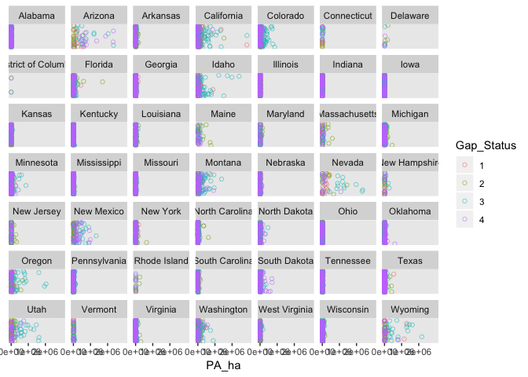
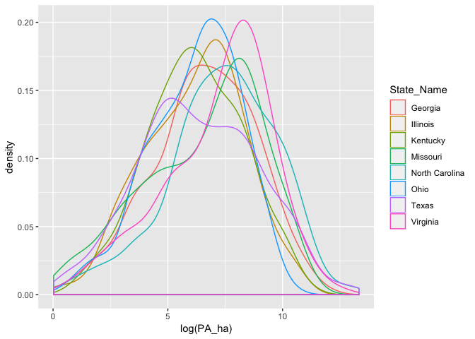

```{r setup, include=FALSE}
knitr::opts_chunk$set(echo = TRUE)
```

# 1.) Data Structure and Sketch of Sample Design:


## The Model:

#### The Statistical Model in mathematical notation:
**State Level Model:**
$$\mu _{j}\sim N(\mu, \sigma  _{s}^{2})$$
**County Level Model**
$$y_{i}\sim N(\mu _{j[i]}, \sigma _{c}^{2})$$


$$\mu _{j}=State\ Mean\ Hectares\ of\ Protected\ Area$$ 

$$j[i]=State\ j\ that\ belongs\ to\ county\ i$$

## Scales of Variables

#### Scales of Variation in the sampling design.
**Scales**: Between state variation and between county variation (residual)
  
**Grouping variables**
  The grouping variables / random effects are states which are comprised of counties state(county)

#### Scale of Response Variable.
   **Hectares of protected area (PA_ha)**

#### Scales of measurement for Predictor Variables.
  **GAP Status (1-4)** = between county predictor and **State GDP** = between state predictor

**In English:** The model has several nested scales. The unit is hectares of protected area, which fall into four groups (Gap Status 1 - 4). Gap Status 1 indicates a protected area of high conservation priority and is most protected, while Gap Status 4 is the least protected. The hectares of protected area of a given Gap Status are aggregated at the county level, such that each county only has one data point for each Gap Status (if all four types are found in the county). County is the second scale in the model, and although I had individual county identifiers, I omitted them from the final model. This is because I wasn't concerned with the results at the county level, and model clarity/interpretability was sacrificed for a minor increase in accuracy. The largest scale is state, and the main predictor variable, state gross domestic product (millions USD) is applied at this scale.
State: State GDP -> County -> Protected Areas: Gap Status 1:4

#### The Final Code Used:
``` r
ppfit_bayes <- stan_lmer( log_PA_ha ~ Gap_Status + logGDP + (1|State_Name), data=dat1 )
```

# 2.) Default Priors:


# 3.) Analysis:

## EDA:
After data cleaning and stacking, I performed some exploratory analyses:


It appeared that most states were skewed toward small protected areas, so I examined the 8 states with the largest area of protected spaces to see if the trend held true.


The states with the most protected area still had a long right tail, so I concluded that a log transformation would be best. After log-transforming the data, the hectares of protected area approached a normal distribution:



For full EDA, see: https://github.com/EBIO5460Fall2018/ds4b_amy_b/blob/master/Individual_project/Final_Codes_Grade_These_Please/Conservation_final.md

## Final Model:
After EDA, among other things, I ran no pooling and partial pooling estimates for the intercept. The dashed blue line represents the partial pooling estimate, and the solid blue line is no pooling. I circled a reference point for a state with few samples, where the difference between the two estimates is most pronounced. The partial pooling model pulled the data points with small sample sizes toward the mean.


Finally, I ran the full Bayesian multilevel model, which included the State GDP predictor variable.


For full model and other estimates, see: https://github.com/EBIO5460Fall2018/ds4b_amy_b/blob/master/Individual_project/Final_Codes_Grade_These_Please/Conservation_final.md


## Simulation:
After I was satisfied with the model, I ran simulations to assess the parameterization and the overall structure of the model. I used the estimates from the Bayesian model to specify parameters in the simulation. Ultimately, the overall mean and both the residual variance and the group variance converged to the 'true' values of the parameters:


For full simulation results see:
https://github.com/EBIO5460Fall2018/ds4b_amy_b/blob/master/Individual_project/Final_Codes_Grade_These_Please/Simulation.md


# 4.) Conclusions:
The aims of this project were to: (1) explore how overall hectares of protected area vary with state GDP, (2) investigate the relative abundance of different types of protected area (Gap Status 1:4) and how those vary with GDP, and finally, (3) make observations about specific states which are under-performing or over-performing given their relative wealth.

#### (1) How Hectares of Protected Area Vary with GDP:
In general, as GDP of state increases, the total area of protected spaces increase. This isn't terribly surprising for two reasons. First, there are costs associated with maintaining protected areas, and poorer states might not have the revenue to support them. Second, richer states tend to be more educated, and with more education comes more concern for the environment.

#### (2) How Hectares of Protected Area Vary with GDP by Gap Status:
This was the most surprising result of the study. In all cases, except for the PA's with the least protection (Gap Status 4), the hectares of protected area increased with state GDP. Gap Status 1 and 2 had nearly identical slopes, with Gap Status 2 being slightly higher. The slope of Gap Status 3 wasn't quite as dramatic, but it was still clearly positive. However, Gap Status 4 had a slightly negative slope, which was surprising. My only idea of an explanation is that poorer states can only afford to maintain protected areas of a lower caliber, so they invest in more low-protection areas rather than a few of high-protection.


#### (3) Which States are doing well and which are not?:
To assess this, I looked for states that deviated furthest from the regression line. Those which were above the line were over-performing, and those below the line were under-performing. Arizona and California were clear winners in terms of revenue dedicated to protected areas. In all Gap Status categories, they had more hectares of protected area than other states with a similar GDP. Arizona was actually higher than California. This was helpful for analysis, because California is also the richest state which means that it is subject to outlier effects. Arizona on the other hand is near the center of the wealth distribution. That means that it would be a good system to study for exploring the social or political mindsets that lead to more conservation. What are they doing right that others are not? What can we learn from Arizona?

The worst-performing state was Iowa. They had far fewer hectares of protected area than other states with similar GDP. Like Arizona, this state would be a good subject for future study.

With all of the assumptions made here, it is important to note that there are other factors that affect the hectares of protected area across states. Among other considerations, some areas are biodiversity 'dead spots' that perhaps don't warrant high levels of protection. Maybe the environment is relatively undisturbed. All of these questions could be answered in a follow-up study of the socio-economic predictors of environmental protection.


