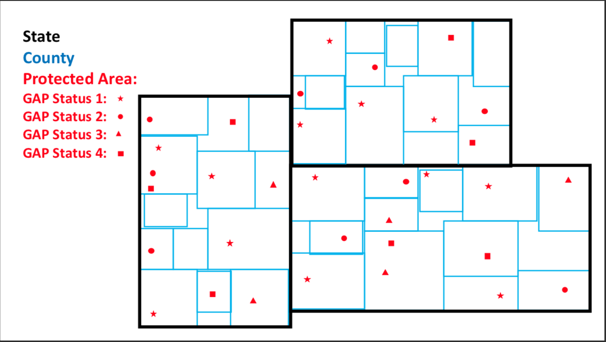

Final Report
================
Benefield
10/31/2018

# 1.) Data Structure and Sketch of Sample Design:



## The Model:

#### The Statistical Model in mathematical notation:

**State Level Model:**   
")  
**County Level Model**   
![y\_{i}\\sim N(\\mu \_{j\[i\]}, \\sigma
\_{c}^{2})](https://latex.codecogs.com/png.latex?y_%7Bi%7D%5Csim%20N%28%5Cmu%20_%7Bj%5Bi%5D%7D%2C%20%5Csigma%20_%7Bc%7D%5E%7B2%7D%29
"y_{i}\\sim N(\\mu _{j[i]}, \\sigma _{c}^{2})")  

  
  

  
![j\[i\]=State\\ j\\ that\\ belongs\\ to\\ county\\
i](https://latex.codecogs.com/png.latex?j%5Bi%5D%3DState%5C%20j%5C%20that%5C%20belongs%5C%20to%5C%20county%5C%20i
"j[i]=State\\ j\\ that\\ belongs\\ to\\ county\\ i")  

## Scales of Variables

#### Scales of Variation in the sampling design.

**Scales**: Between state variation and between county variation
(residual)

**Grouping variables** The grouping variables / random effects are
states which are comprised of counties state(county)

#### Scale of Response Variable.

**Hectares of protected area (PA\_ha)**

#### Scales of measurement for Predictor Variables.

**GAP Status (1-4)** = between county predictor and **State GDP** =
between state predictor

**In English:** The model has several nested scales. The unit is
hectares of protected area, which fall into four groups (Gap Status 1 -
4). Gap Status 1 indicates a protected area of high conservation
priority and is most protected, while Gap Status 4 is the least
protected. The hectares of protected area of a given Gap Status are
aggregated at the county level, such that each county only has one data
point for each Gap Status (if all four types are found in the county).
County is the second scale in the model, and although I had individual
county identifiers, I omitted them from the final model. This is because
I wasn’t concerned with the results at the county level, and model
clarity/interpretability was sacrificed for a minor increase in
accuracy. The largest scale is state, and the main predictor variable,
state gross domestic product (millions USD) is applied at this scale.
State: State GDP -\> County -\> Protected Areas: Gap Status
1:4

#### The Final Code Used:

``` r
ppfit_bayes <- stan_lmer( log_PA_ha ~ Gap_Status + logGDP + (1|State_Name), data=dat1 )
```

# 2.) Default Priors:

``` r
Priors for model 'ppfit_bayes' 
------
Intercept (after predictors centered)
 ~ normal(location = 0, scale = 10)
     **adjusted scale = 26.70

Coefficients
 ~ normal(location = [0,0,0,...], scale = [2.5,2.5,2.5,...])
     **adjusted scale = [6.67,6.67,6.67,...]

Auxiliary (sigma)
 ~ exponential(rate = 1)
     **adjusted scale = 2.67 (adjusted rate = 1/adjusted scale)

Covariance
 ~ decov(reg. = 1, conc. = 1, shape = 1, scale = 1)
------
```

# 3.) Analysis:

## EDA:

After data cleaning and stacking, I performed some exploratory analyses:


It appeared that most states were skewed toward small protected areas,
so I examined the 8 states with the largest area of protected spaces to
see if the trend held true.


The states with the most protected area still had a long right tail, so
I concluded that a log transformation would be best. After
log-transforming the data, the hectares of protected area approached a
normal distribution:


For full EDA, see:
<https://github.com/EBIO5460Fall2018/ds4b_amy_b/blob/master/Individual_project/Final_Codes_Grade_These_Please/Conservation_final.md>

## Final Model:

After EDA, among other things, I ran no pooling and partial pooling
estimates for the intercept. The dashed blue line represents the partial
pooling estimate, and the solid blue line is no pooling. I circled a
reference point for a state with few samples, where the difference
between the two estimates is most pronounced. The partial pooling model
pulled the data points with small sample sizes toward the mean.


Finally, I ran the full Bayesian multilevel model, which included the
State GDP predictor variable.


For full model and other estimates, see:
<https://github.com/EBIO5460Fall2018/ds4b_amy_b/blob/master/Individual_project/Final_Codes_Grade_These_Please/Conservation_final.md>

## Simulation:

After I was satisfied with the model, I ran simulations to assess the
parameterization and the overall structure of the model. I used the
estimates from the Bayesian model to specify parameters in the
simulation. Ultimately, the overall mean and both the residual variance
and the group variance converged to the ‘true’ values of the parameters:


For full simulation results see:
<https://github.com/EBIO5460Fall2018/ds4b_amy_b/blob/master/Individual_project/Final_Codes_Grade_These_Please/Simulation.md>

# 4.) Conclusions:

The aims of this project were to: (1) explore how overall hectares of
protected area vary with state GDP, (2) investigate the relative
abundance of different types of protected area (Gap Status 1:4) and how
those vary with GDP, and finally, (3) make observations about specific
states which are under-performing or over-performing given their
relative wealth.

#### (1) How Hectares of Protected Area Vary with GDP:

In general, as GDP of state increases, the total area of protected
spaces increase. This isn’t terribly surprising for two reasons. First,
there are costs associated with maintaining protected areas, and poorer
states might not have the revenue to support them. Second, richer states
tend to be more educated, and with more education comes more concern for
the environment.

#### (2) How Hectares of Protected Area Vary with GDP by Gap Status:

This was the most surprising result of the study. In all cases, except
for the PA’s with the least protection (Gap Status 4), the hectares of
protected area increased with state GDP. Gap Status 1 and 2 had nearly
identical slopes, with Gap Status 2 being slightly higher. The slope of
Gap Status 3 wasn’t quite as dramatic, but it was still clearly
positive. However, Gap Status 4 had a slightly negative slope, which was
surprising. My only idea of an explanation is that poorer states can
only afford to maintain protected areas of a lower caliber, so they
invest in more low-protection areas rather than a few of
high-protection.


#### (3) Which States are doing well and which are not?:

To assess this, I looked for states that deviated furthest from the
regression line. Those which were above the line were over-performing,
and those below the line were under-performing. Arizona and California
were clear winners in terms of revenue dedicated to protected areas. In
all Gap Status categories, they had more hectares of protected area than
other states with a similar GDP. Arizona was actually higher than
California. This was helpful for analysis, because California is also
the richest state which means that it is subject to outlier effects.
Arizona on the other hand is near the center of the wealth distribution.
That means that it would be a good system to study for exploring the
social or political mindsets that lead to more conservation. What are
they doing right that others are not? What can we learn from Arizona?

The worst-performing state was Iowa. They had far fewer hectares of
protected area than other states with similar GDP. Like Arizona, this
state would be a good subject for future study.

With all of the assumptions made here, it is important to note that
there are other factors that affect the hectares of protected area
across states. Among other considerations, some areas are biodiversity
‘dead spots’ that perhaps don’t warrant high levels of protection.
Maybe the environment is relatively undisturbed. All of these questions
could be answered in a follow-up study of the socio-economic predictors
of environmental protection.
