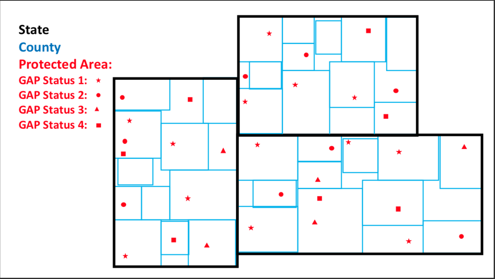
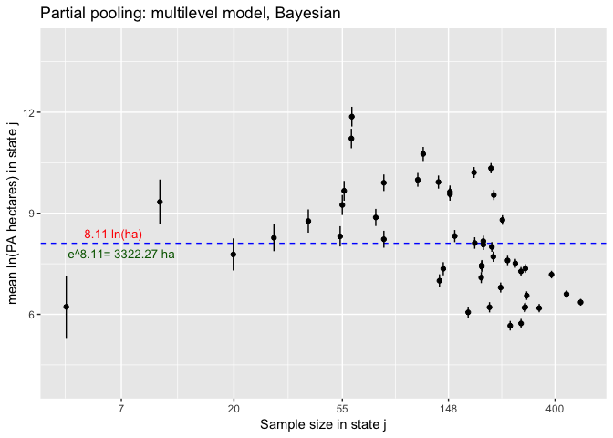

```{r setup, include=FALSE}
knitr::opts_chunk$set(echo = TRUE)
```

## Scales of Variables

#### (1.) Scales of Variation in the sampling design.
**Scales**: Between state variation and between county variation (residual)
  
**Grouping variables**
  The grouping variables / random effects are states which are comprised of counties state(county)

#### (2.) Scale of Response Variable.
   **Hectares of protected area (PA_ha)**

#### (3.) Scales of measurement for Predictor Variables.
  **GAP Status (1-4)** = between county predictor and **State GDP** = between state predictor (?)

#### Sketch of Sample Design:




## The Model:

#### (1.) The Statistical Model in mathematical notation:
**State Level Model:**
$$\mu _{j}\sim N(\mu, \sigma  _{s}^{2})$$
**County Level Model**
$$y_{i}\sim N(\mu _{j[i]}, \sigma _{c}^{2})$$


$$\mu _{j}=State\ Mean\ Hectares\ of\ Protected\ Area$$ 

$$j[i]=State\ j\ that\ belongs\ to\ county\ i$$

#### (2.) Write down the corresponding linear model formula for stan_lmer/stan_glmer.
``` r
ppfit_bayes <- stan_lmer( log_PA_ha ~ 1 + (1|State_Name), data=dat1 )
print(summary(ppfit_bayes)[,c(1,3,9,10)],digits=3)
```




